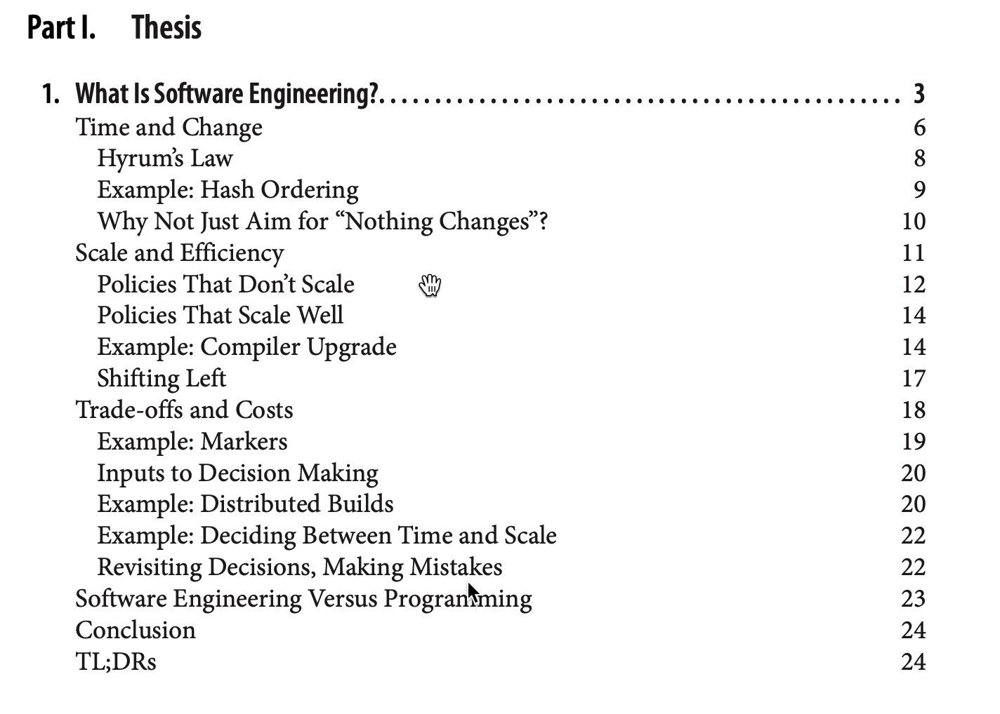

# 如何参与本书编写
由于Github上的组织是要收费的，所以我们以contributors的形式参与本书编写，关于[Github上如何给他人项目做贡献](https://github.com/firstcontributions/first-contributions)文章有很多，大家可以自行检索。
本书Github地址为：[https://github.com/tomatpfg/swe-at-google](https://github.com/tomatpfg/swe-at-google)

下面是关于本项目的介绍

###一、目录
```bash
├── Part_0
│   └── figures    // 图例目录
│       ├── Part_0_figure_1.png  // 某图例
│   └── README.md  // 本篇文章
├── Part_I_Thesis  // 第一部分的文件夹
│   ├── README.md  // 第一部分的落地页
│   └── What_Is_Software_Engineering // 第一章的文件夹
│       ├── Conclusion.md  // 第一章某章节
│       ├── README.md  // 第一章的落地页
│       ├── Scale_and_Efficiency.md  // 第一章某章节
│       ├── Software_Engineering_Versus_Programming.md  // 第一章某章节
│       ├── TL_DRs.md  // 第一章某章节
│       ├── Time_and_Change.md  // 第一章某章节
│       └── Trade_offs_and_Costs.md  // 第一章某章节
├── README.md    // 本书落地页
├── SUMMARY.md   // 本书的目录
├── foreword.md  // 本书前言
```
以下为原书参照图



因为Markdown文件过大某些情况下会有卡死情况，再一个为了方便协作，所以每章又拆分成了不同的章节文件，但是没必要再拆分下去了。后面的部分和章节拆解参考第一章即可。


###二、添加章节到目录

章节文件创建后即可在根目录SUMMARY.md文件创建关联。
```
* [第一部分 论题](Part_I_Thesis/README.md)
  * [1. 什么是软件工程？](Part_I_Thesis/What_Is_Software_Engineering/README.md)
    * [时间与变更](Part_I_Thesis/What_Is_Software_Engineering/Time_and_Change.md)
    * [范围与效率](Part_I_Thesis/What_Is_Software_Engineering/Scale_and_Efficiency.md)
    * [权衡和成本](Part_I_Thesis/What_Is_Software_Engineering/Trade_offs_and_Costs.md)
    * [软件工程与编程](Part_I_Thesis/What_Is_Software_Engineering/Software_Engineering_Versus_Programming.md)
    * [结论](Part_I_Thesis/What_Is_Software_Engineering/Conclusion.md)
    * [TL;DRs](Part_I_Thesis/What_Is_Software_Engineering/TL_DRs.md)
```

###三、完成章节内容
通常我们每个章节包含几个部分：
* 英文原文
* 中文译文
* 图例
* 注解
* 有疑问的部分

我们约定如下：
####1. 英文原文
```
<details> <summary>英文原文</summary><div style="border:1px solid #eee;padding:5px;background-color:#F2F2F2">
This is an apple.
</div></details>
```
####2. 中文译文
走正常Markdown语法即可
####3. 图例
图例命名规则为:
```
Part_{部分号}_Chapter_{章节号}_figure_{图顺序号}.png
```
引用方式
```

```
####4.注解
通常比较好的注解方式如下：
```
它们可能会造成大量金钱损失、财产损失，或者最糟糕的是，造成生命损失。[^2]
```
在文章的末尾加上
```
[^2]:See “[Failure at Dhahran](https://oreil.ly/lhO7Z).”
```
这种方式在Github和IDE markdown插件里都可以很好的关联，但是目前Gitbook不支持此种方式，所以我们这里在段落内直接引入注解。
```
它们可能会造成大量金钱损失、财产损失，或者最糟糕的是，造成生命损失。[^2]（<mark style="color:orange;">See “[Failure at Dhahran](https://oreil.ly/lhO7Z).</mark>）
```
####5.有疑问的部分
在翻译的过程中，难免遇到翻译之后还无法理解的语句，针对这样的句子，建议加颜色来做出提示。
```
<mark style="color:red;">通常，该频谱短端的代码不受时间影响</mark>
```

其他大部分的语法大家都可以在第一章中找到，如果有疑问可以随时联系我。