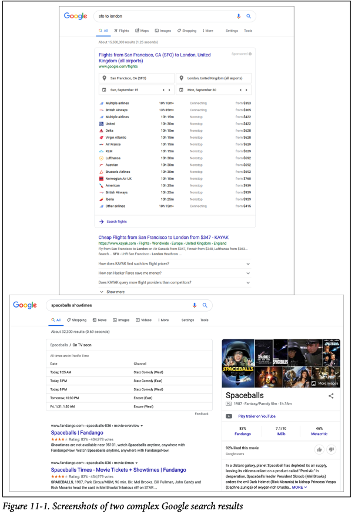
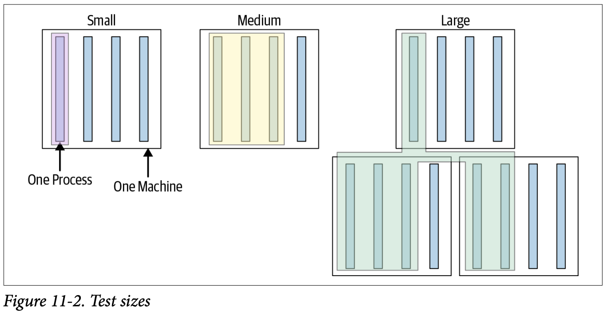
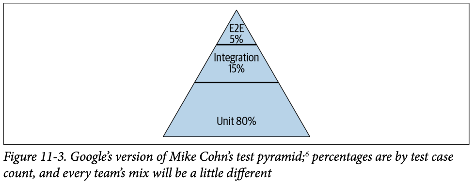
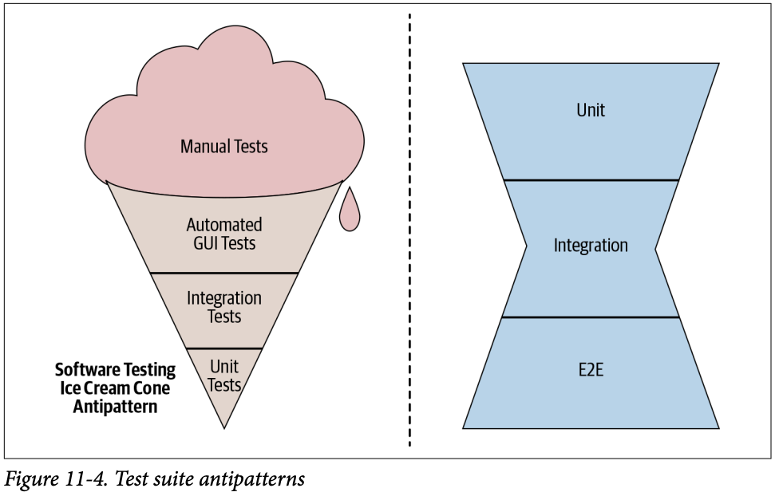

**<p align="right">第11章</p>**  
-- -  
**<p align="right">测试概述（Testing overview）</p>**  

*<p align="right">作者： Adam Bender</p>* 
*<p align="right">编辑： Tom Manshreck</p>*

<details> <summary>origin</summary><div style="border:1px solid #eee;padding:5px;background-color:#F2F2F2">
Testing has always been a part of programming. In fact, the first time you wrote a computer program you almost certainly threw some sample data at it to see whether it performed as you expected. For a long time, the state of the art in software testing resembled a very similar process, largely manual and error prone. However, since the early 2000s, the software industry’s approach to testing has evolved dramatically to cope with the size and complexity of modern software systems. Central to that evolution has been the practice of developer-driven, automated testing.
</div></details>

测试一直是编程的一部分。事实上，当您第一次编写计算机程序时，您几乎肯定会向它抛出一些样本数据，看看它是否按照您的预期运行。在很长一段时间里，软件测试的技术状态类似于一个非常相似的过程，大部分是手工的，并且很容易出错。然而，自21世纪初以来，软件行业的测试方法已经发生了巨大的变化，以应对现代软件系统的规模和复杂性。这种发展的核心是开发人员驱动的自动化测试的实践。

<details> <summary>origin</summary><div style="border:1px solid #eee;padding:5px;background-color:#F2F2F2">
Automated testing can prevent bugs from escaping into the wild and affecting your users. The later in the development cycle a bug is caught, the more expensive it is; exponentially so in many cases.However, “catching bugs” is only part of the motivation. An equally important reason why you want to test your software is to support the ability to change. Whether you’re adding new features, doing a refactoring focused on code health, or undertaking a larger redesign, automated testing can quickly catch mistakes, and this makes it possible to change software with confidence.
</div></details>

自动化测试可以防止错误泛滥并影响您的用户。在开发周期中，越晚发现漏洞，代价就越高;在许多情况下，指数上是如此然而，“捕捉bug”只是动机的一部分。测试软件的一个同样重要的原因是为了支持更改的能力。[^1]无论您是在添加新特性、进行代码健康度重构，还是进行更大规模的重新设计，自动化测试都可以快速地捕获错误，这使得您可以满怀信心地更改软件。

<details> <summary>origin</summary><div style="border:1px solid #eee;padding:5px;background-color:#F2F2F2">
Companies that can iterate faster can adapt more rapidly to changing technologies, market conditions, and customer tastes. If you have a robust testing practice, you needn’t fear change—you can embrace it as an essential quality of developing software. The more and faster you want to change your systems, the more you need a fast way to test them.
</div></details>
能够更快地进行迭代的公司能够更快地适应不断变化的技术、市场条件和客户口味。如果您有一个健壮的测试实践，您就不必害怕变更——您可以将其作为开发软件的基本质量来接受。您想要更改系统的次数越多、速度越快，就越需要一种快速的方法来测试它们。

<details> <summary>origin</summary><div style="border:1px solid #eee;padding:5px;background-color:#F2F2F2">
The act of writing tests also improves the design of your systems. As the first clients of your code, a test can tell you much about your design choices. Is your system too tightly coupled to a database? Does the API support the required use cases? Does your system handle all of the edge cases? Writing automated tests forces you to confront these issues early on in the development cycle. Doing so generally leads to more modular software that enables greater flexibility later on.
</div></details>
编写测试的行为还可以改进系统的设计。作为代码的第一个客户端，测试可以告诉您很多关于设计选择的信息。您的系统是否与数据库耦合得太紧?API是否支持所需的用例?你的系统能处理所有的边缘情况吗?编写自动化测试迫使您在开发周期的早期就面对这些问题。这样做通常会导致更模块化的软件，从而在以后实现更大的灵活性。

<details> <summary>origin</summary><div style="border:1px solid #eee;padding:5px;background-color:#F2F2F2">

Much ink has been spilled about the subject of testing software, and for good reason: for such an important practice, doing it well still seems to be a mysterious craft to many. At Google, while we have come a long way, we still face difficult problems getting our processes to scale reliably across the company. In this chapter, we’ll share what we have learned to help further the conversation.
</div></details>
关于软件测试这个话题已经有了很多的讨论，而且有充分的理由:对于这样一个重要的实践，做好它对许多人来说仍然是一件神秘的事情。在Google，虽然我们已经取得了很大的进展，但我们仍然面临着困难的问题，即如何让我们的流程在整个公司范围内可靠地扩展。在本章中，我们将分享我们所学到的知识，以帮助进一步对话。

## 为什么我们需要编写测试 Why Do We Write Tests?

<details> <summary>origin</summary><div style="border:1px solid #eee;padding:5px;background-color:#F2F2F2">

To better understand how to get the most out of testing, let’s start from the beginning. When we talk about automated testing, what are we really talking about? The simplest test is defined by: 
- A single behavior you are testing, usually a method or API that you are calling 
- A specific input, some value that you pass to the API 
- An observable output or behavior
- A controlled environment such as a single isolated process
</div></details>

为了更好地了解如何充分利用测试，让我们从头开始。当我们谈论自动化测试时，我们真正在谈论什么？最简单的测试定义为：
- 您正在测试的单个行为，通常是您正在调用的方法或 API
- 特定输入，您传递给 API 的一些值
- 可观察到的输出或行为
- 受控环境，例如单个隔离过程

<details> <summary>origin</summary><div style="border:1px solid #eee;padding:5px;background-color:#F2F2F2">
When you execute a test like this, passing the input to the system and verifying the output, you will learn whether the system behaves as you expect. Taken in aggregate, hundreds or thousands of simple tests (usually called a test suite) can tell you how well your entire product conforms to its intended design and, more important, when it doesn’t.
</div></details>
当您执行这样的测试，将输入传递给系统并验证输出时，您将了解系统是否按预期运行。总的来说，数百或数千个简单测试（通常称为测试套件）可以告诉您整个产品与其预期设计的符合程度，更重要的是，何时不符合。


<details> <summary>origin</summary><div style="border:1px solid #eee;padding:5px;background-color:#F2F2F2">

Creating and maintaining a healthy test suite takes real effort. As a codebase grows, so too will the test suite. It will begin to face challenges like instability and slowness. A failure to address these problems will cripple a test suite. Keep in mind that tests derive their value from the trust engineers place in them. If testing becomes a productivity sink, constantly inducing toil and uncertainty, engineers will lose trust and begin to find workarounds. A bad test suite can be worse than no test suite at all.
</div></details>
创建和维护一个健康的测试套件需要付出真正的努力。随着代码库的增长，测试套件也会增长。它将开始面临不稳定和缓慢等挑战。未能解决这些问题将削弱测试套件。请记住，测试的价值来自工程师对它们的信任。如果测试成为生产力的下沉，不断地导致劳动和不确定性，工程师将失去信任并开始寻找解决方法。一个糟糕的测试套件可能比没有测试套件更糟糕。

<details> <summary>origin</summary><div style="border:1px solid #eee;padding:5px;background-color:#F2F2F2">
In addition to empowering companies to build great products quickly, testing is becoming critical to ensuring the safety of important products and services in our lives. Software is more involved in our lives than ever before, and defects can cause more than a little annoyance: they can cost massive amounts of money, loss of property, or, worst of all, loss of life.
</div></details>

除了使公司能够快速构建出色的产品外，测试对于确保我们生活中重要产品和服务的安全性也变得至关重要。软件比以往任何时候都更多地参与到我们的生活中，而缺陷可能会带来更多的烦恼：它们可能会造成大量金钱损失、财产损失，或者最糟糕的是，造成生命损失。[^2]

<details> <summary>origin</summary><div style="border:1px solid #eee;padding:5px;background-color:#F2F2F2">
At Google, we have determined that testing cannot be an afterthought. Focusing on quality and testing is part of how we do our jobs. We have learned, sometimes painfully, that failing to build quality into our products and services inevitably leads to bad outcomes. As a result, we have built testing into the heart of our engineering culture.
</div></details>
在 Google，我们已经确定测试不能是事后的想法。专注于质量和测试是我们工作的一部分。我们有时痛苦地了解到，未能在我们的产品和服务中建立质量不可避免地会导致糟糕的结果。因此，我们已将测试纳入我们工程文化的核心。

### The Story of Google Web Server

<details> <summary>origin</summary><div style="border:1px solid #eee;padding:5px;background-color:#F2F2F2">
In Google’s early days, engineer-driven testing was often assumed to be of little importance. Teams regularly relied on smart people to get the software right. A few systems ran large integration tests, but mostly it was the Wild West. One product in particular seemed to suffer the worst: it was called the Google Web Server, also known as GWS.
</div></details>

在Google的早期，工程师驱动的测试通常被认为并不重要。团队经常依靠聪明的人来获得正确的软件。一些系统运行了大型集成测试，但主要是狂野西部。尤其是一种产品似乎遭受了最严重的损失：它被称为 Google Web Server，也称为 GWS。

<details> <summary>origin</summary><div style="border:1px solid #eee;padding:5px;background-color:#F2F2F2">
GWS is the web server responsible for serving Google Search queries and is as important to Google Search as air traffic control is to an airport. Back in 2005, as the project swelled in size and complexity, productivity had slowed dramatically. Releases were becoming buggier, and it was taking longer and longer to push them out. Team members had little confidence when making changes to the service, and often found out something was wrong only when features stopped working in production. (At one point, more than 80% of production pushes contained user-affecting bugs that had to be rolled back.)

</div></details>

GWS 是负责为 Google 搜索查询提供服务的网络服务器，它对 Google 搜索的重要性不亚于空中交通管制对机场的重要性。早在 2005 年，随着项目规模和复杂性的扩大，生产力急剧下降。发布变得越来越错误，将它们推出所需的时间越来越长。团队成员在对服务进行更改时缺乏信心，并且经常只有在功能停止在生产中工作时才发现有问题。 （在某一时刻，超过 80% 的生产推送包含必须回滚的影响用户的错误。）

<details> <summary>origin</summary><div style="border:1px solid #eee;padding:5px;background-color:#F2F2F2">
To address these problems, the tech lead (TL) of GWS decided to institute a policy of engineer-driven, automated testing. As part of this policy, all new code changes were required to include tests, and those tests would be run continuously. Within a year of instituting this policy, the number of emergency pushes dropped by half. This drop occurred despite the fact that the project was seeing a record number of new changes every quarter. Even in the face of unprecedented growth and change, testing brought renewed productivity and confidence to one of the most critical projects at Google. Today, GWS has tens of thousands of tests, and releases almost every day with relatively few customer-visible failures.
</div></details>
为了解决这些问题，GWS 的技术主管 (TL) 决定制定工程师驱动的自动化测试政策。作为该政策的一部分，所有新的代码更改都必须包含测试，并且这些测试将持续运行。该政策实施一年内，紧急推送次数减少了一半。尽管该项目每个季度都有创纪录的新变化，但还是出现了这种下降。即使面对前所未有的增长和变化，测试也为 Google 最关键的项目之一带来了新的生产力和信心。如今，GWS 已经进行了数以万计的测试，并且几乎每天都会发布，客户可见的故障相对较少。

<details> <summary>origin</summary><div style="border:1px solid #eee;padding:5px;background-color:#F2F2F2">
The changes in GWS marked a watershed for testing culture at Google as teams in other parts of the company saw the benefits of testing and moved to adopt similar tactics.
</div></details>

GWS 的变化标志着Google测试文化的一个分水岭，因为公司其他部门的团队看到了测试的好处，并采取了类似的策略。

<details> <summary>origin</summary><div style="border:1px solid #eee;padding:5px;background-color:#F2F2F2">
One of the key insights the GWS experience taught us was that you can’t rely on programmer ability alone to avoid product defects. Even if each engineer writes only the occasional bug, after you have enough people working on the same project, you will be swamped by the ever-growing list of defects. Imagine a hypothetical 100-person team whose engineers are so good that they each write only a single bug a month. Collectively, this group of amazing engineers still produces five new bugs every workday. Worse yet, in a complex system, fixing one bug can often cause another, as engineers adapt to known bugs and code around them.
</div></details>

GWS 经验告诉我们的关键见解之一是，您不能仅依靠程序员的能力来避免产品缺陷。即使每个工程师只写偶尔的错误，当你有足够多的人在同一个项目上工作时，你也会被不断增长的缺陷列表所淹没。想象一个假设的 100 人团队，其工程师非常优秀，以至于每个人每个月只写一个 bug。总的来说，这群了不起的工程师每个工作日仍然会产生五个新的错误。更糟糕的是，在一个复杂的系统中，修复一个错误通常会导致另一个错误，因为工程师会适应已知的错误和围绕它们的代码。

<details> <summary>origin</summary><div style="border:1px solid #eee;padding:5px;background-color:#F2F2F2">
The best teams find ways to turn the collective wisdom of its members into a benefit for the entire team. That is exactly what automated testing does. After an engineer on the team writes a test, it is added to the pool of common resources available to others. Everyone else on the team can now run the test and will benefit when it detects an issue. Contrast this with an approach based on debugging, wherein each time a bug occurs, an engineer must pay the cost of digging into it with a debugger. The cost in engineering resources is night and day and was the fundamental reason GWS was able to turn its fortunes around.
</div></details>

最好的团队想方设法将其成员的集体智慧转化为整个团队的利益。这正是自动化测试所做的。团队中的工程师编写测试后，会将其添加到其他人可用的公共资源池中。团队中的其他人现在都可以运行测试，并在检测到问题时受益。将此与基于调试的方法进行对比，其中每次发生错误时，工程师都必须支付使用调试器进行挖掘的成本。工程资源的成本是日以继夜的，这是 GWS 能够扭转命运的根本原因。

### Testing at the Speed of Modern Development

<details> <summary>origin</summary><div style="border:1px solid #eee;padding:5px;background-color:#F2F2F2">
Software systems are growing larger and ever more complex. A typical application or service at Google is made up of thousands or millions of lines of code. It uses hundreds of libraries or frameworks and must be delivered via unreliable networks to an increasing number of platforms running with an uncountable number of configurations. To make matters worse, new versions are pushed to users frequently, sometimes multiple times each day. This is a far cry from the world of shrink-wrapped software that saw updates only once or twice a year.
</div></details>
软件系统变得越来越大，越来越复杂。 Google 的典型应用程序或服务由数千或数百万行代码组成。它使用数百个库或框架，并且必须通过不可靠的网络交付给越来越多的运行着无数配置的平台。更糟糕的是，新版本被频繁地推送给用户，有时每天多次推送。这与每年只更新一两次的收缩包装软件的世界相去甚远。

<details> <summary>origin</summary><div style="border:1px solid #eee;padding:5px;background-color:#F2F2F2">
The ability for humans to manually validate every behavior in a system has been unable to keep pace with the explosion of features and platforms in most software. Imagine what it would take to manually test all of the functionality of Google Search, like finding flights, movie times, relevant images, and of course web search results (see Figure 11-1). Even if you can determine how to solve that problem, you then need to multiply that workload by every language, country, and device Google Search must support, and don’t forget to check for things like accessibility and security. Attempting to assess product quality by asking humans to manually interact with every feature just doesn’t scale. When it comes to testing, there is one clear answer: automation
</div></details>

人类手动验证系统中每个行为的能力已经无法跟上大多数软件中功能和平台的爆炸式增长。想象一下手动测试 Google 搜索的所有功能需要什么，比如查找航班、电影时间、相关图像，当然还有网络搜索结果（见图 11-1）。即使您可以确定如何解决该问题，您也需要将工作量乘以 Google 搜索必须支持的每种语言、国家和设备，并且不要忘记检查可访问性和安全性等内容。试图通过要求人类手动与每个功能交互来评估产品质量是无法扩展的。谈到测试，有一个明确的答案：自动化



### Write, Run, React

<details> <summary>origin</summary><div style="border:1px solid #eee;padding:5px;background-color:#F2F2F2">
In its purest form, automating testing consists of three activities: writing tests, running tests, and reacting to test failures. An automated test is a small bit of code, usually a single function or method, that calls into an isolated part of a larger system that you want to test. The test code sets up an expected environment, calls into the system, usually with a known input, and verifies the result. Some of the tests are very small, exercising a single code path; others are much larger and can involve entire systems, like a mobile operating system or web browser.
</div></details>

就其最纯粹的形式而言，自动化测试包括三个活动：编写测试、运行测试和对测试失败做出反应。 自动化测试是一小段代码，通常是单个函数或方法，它调用您想要测试的更大系统的一个隔离部分。 测试代码设置一个预期的环境，调用系统，通常使用已知的输入，并验证结果。 一些测试非常小，执行单个代码路径； 其他的则更大，可能涉及整个系统，例如移动操作系统或 Web 浏览器。


<details> <summary>origin</summary><div style="border:1px solid #eee;padding:5px;background-color:#F2F2F2">
Example 11-1 presents a deliberately simple test in Java using no frameworks or testing libraries. This is not how you would write an entire test suite, but at its core every automated test looks similar to this very simple example.

Example 11-1. An example test
</div></details>
示例 11-1 展示了一个特意使用 Java 进行的简单测试，不使用任何框架或测试库。 这不是您编写整个测试套件的方式，但在其核心，每个自动化测试看起来都类似于这个非常简单的示例。

例 11-1。 示例测试

```c++
// Verifies a Calculator class can handle negative results.
public void main(String[] args) {
 Calculator calculator = new Calculator();
 int expectedResult = -3;
 int actualResult = calculator.subtract(2, 5); // Given 2, Subtracts 5.
 assert(expectedResult == actualResult);
}
```

<details> <summary>origin</summary><div style="border:1px solid #eee;padding:5px;background-color:#F2F2F2">
Unlike the QA processes of yore, in which rooms of dedicated software testers pored over new versions of a system, exercising every possible behavior, the engineers who build systems today play an active and integral role in writing and running automated tests for their own code. Even in companies where QA is a prominent organization, developer-written tests are commonplace. At the speed and scale that today’s systems are being developed, the only way to keep up is by sharing the development of tests around the entire engineering staff.
</div></details>

与过去的 QA 流程不同，在过去的 QA 流程中，专门的软件测试人员在房间里仔细研究系统的新版本，练习每一种可能的行为，而如今构建系统的工程师在为自己的代码编写和运行自动化测试方面发挥着积极而不可或缺的作用。即使在 QA 是一个重要组织的公司中，开发人员编写的测试也是司空见惯的。以当今系统开发的速度和规模，跟上步伐的唯一方法是在整个工程人员中共享测试的开发。

<details> <summary>origin</summary><div style="border:1px solid #eee;padding:5px;background-color:#F2F2F2">
Of course, writing tests is different from writing good tests. It can be quite difficult to train tens of thousands of engineers to write good tests. We will discuss what we have learned about writing good tests in the chapters that follow.
</div></details>
当然，编写测试不同于编写好的测试。培训成千上万的工程师编写好的测试是相当困难的。我们将在接下来的章节中讨论我们学到的关于编写好的测试的知识。

<details> <summary>origin</summary><div style="border:1px solid #eee;padding:5px;background-color:#F2F2F2">
Writing tests is only the first step in the process of automated testing. After you have written tests, you need to run them. Frequently. At its core, automated testing consists of repeating the same action over and over, only requiring human attention when something breaks. We will discuss this Continuous Integration (CI) and testing in Chapter 23. By expressing tests as code instead of a manual series of steps, we can run them every time the code changes—easily thousands of times per day. Unlike human testers, machines never grow tired or bored.
</div></details>
编写测试只是自动化测试过程中的第一步。编写完测试后，您需要运行它们。频繁地。自动化测试的核心是一遍又一遍地重复相同的操作，只有在出现问题时才需要人工注意。我们将在第 23 章讨论这种持续集成（CI）和测试。通过将测试表达为代码而不是手动的一系列步骤，我们可以在每次代码更改时运行它们——每天轻松数千次。与人类测试人员不同，机器永远不会感到疲倦或无聊。

<details> <summary>origin</summary><div style="border:1px solid #eee;padding:5px;background-color:#F2F2F2">
Another benefit of having tests expressed as code is that it is easy to modularize them for execution in various environments. Testing the behavior of Gmail in Firefox requires no more effort than doing so in Chrome, provided you have configurations for both of these systems.Running tests for a user interface (UI) in Japanese or German can be done using the same test code as for English.
</div></details>

将测试表示为代码的另一个好处是可以很容易地将它们模块化以在各种环境中执行。在 Firefox 中测试 Gmail 的行为与在 Chrome 中测试一样，只要您对这两个系统都有配置。[^3]运行日语或德语用户界面 (UI) 的测试可以使用相同的测试代码来完成英语。

<details> <summary>origin</summary><div style="border:1px solid #eee;padding:5px;background-color:#F2F2F2">
Products and services under active development will inevitably experience test failures. What really makes a testing process effective is how it addresses test failures. Allowing failing tests to pile up quickly defeats any value they were providing, so it is imperative not to let that happen. Teams that prioritize fixing a broken test within minutes of a failure are able to keep confidence high and failure isolation fast, and therefore derive more value out of their tests.
</div></details>
积极开发中的产品和服务不可避免地会出现测试失败。真正使测试过程有效的是它如何解决测试失败。让失败的测试迅速堆积起来会破坏他们提供的任何价值，因此必须不要让这种情况发生。优先在失败后几分钟内修复损坏的测试的团队能够保持高信心和快速隔离故障，因此从他们的测试中获得更多价值。

<details> <summary>origin</summary><div style="border:1px solid #eee;padding:5px;background-color:#F2F2F2">
In summary, a healthy automated testing culture encourages everyone to share the work of writing tests. Such a culture also ensures that tests are run regularly. Last, and perhaps most important, it places an emphasis on fixing broken tests quickly so as to maintain high confidence in the process.
</div></details>
总之，健康的自动化测试文化鼓励每个人分享编写测试的工作。这种文化还确保定期运行测试。最后，也许也是最重要的一点，它强调快速修复损坏的测试，以保持对该过程的高度信心。

### Benefits of Testing Code
<details> <summary>origin</summary><div style="border:1px solid #eee;padding:5px;background-color:#F2F2F2">
To developers coming from organizations that don’t have a strong testing culture, the idea of writing tests as a means of improving productivity and velocity might seem antithetical. After all, the act of writing tests can take just as long (if not longer!) than implementing a feature would take in the first place. On the contrary, at Google, we’ve found that investing in software tests provides several key benefits to developer productivity:
</div></details>

对于来自没有强大测试文化的组织的开发人员来说，编写测试作为一种提高生产力和速度的方法的想法似乎是对立的。毕竟，编写测试所花费的时间可能和实现特性所花费的时间一样长(如果不是更长的话!)。相反，在Google，我们发现在软件测试上的投资为开发人员的生产力提供了几个关键的好处:

<details> <summary>origin</summary><div style="border:1px solid #eee;padding:5px;background-color:#F2F2F2">


*Less debugging*

As you would expect, tested code has fewer defects when it is submitted. Critically, it also has fewer defects throughout its existence; most of them will be caught before the code is submitted. A piece of code at Google is expected to be modified dozens of times in its lifetime. It will be changed by other teams and even automated code maintenance systems. A test written once continues to pay dividends and prevent costly defects and annoying debugging sessions through the lifetime of the project. Changes to a project, or the dependencies of a project, that break a test can be quickly detected by test infrastructure and rolled back before the problem is ever released to production.

*Increased confidence in changes*

All software changes. Teams with good tests can review and accept changes to their project with confidence because all important behaviors of their project are continuously verified. Such projects encourage refactoring. Changes that refactor code while preserving existing behavior should (ideally) require no changes to existing tests.

*Improved documentation*

Software documentation is notoriously unreliable. From outdated requirements to missing edge cases, it is common for documentation to have a tenuous relationship to the code. Clear, focused tests that exercise one behavior at a time function as executable documentation. If you want to know what the code does in a particular case, look at the test for that case. Even better, when requirements change and new code breaks an existing test, we get a clear signal that the “documentation” is now out of date. Note that tests work best as documentation only if care is taken to keep them clear and concise.

*Simpler reviews*

All code at Google is reviewed by at least one other engineer before it can be submitted (see Chapter 9 for more details). A code reviewer spends less effort verifying code works as expected if the code review includes thorough tests that demonstrate code correctness, edge cases, and error conditions. Instead of the tedious effort needed to mentally walk each case through the code, the reviewer can verify that each case has a passing test. 

*Thoughtful design 

Writing tests for new code is a practical means of exercising the API design of the code itself. If new code is difficult to test, it is often because the code being tested has too many responsibilities or difficult-to-manage dependencies. Welldesigned code should be modular, avoiding tight coupling and focusing on specific responsibilities. Fixing design issues early often means less rework later. 

*Fast, high-quality releases *

With a healthy automated test suite, teams can release new versions of their application with confidence. Many projects at Google release a new version to production every day—even large projects with hundreds of engineers and thousands of code changes submitted every day. This would not be possible without automated testing.

</div></details>

*更少的调试*

正如您所期望的那样，经过测试的代码在提交时缺陷更少。关键的是，它在整个存在过程中也有较少的缺陷;它们中的大多数将在代码提交之前被捕获。Google的一段代码在其生命周期中预计会被修改数十次。它将由其他团队甚至自动化代码维护系统进行更改。在项目的整个生命周期中，编写一次的测试将继续带来好处，并防止代价高昂的缺陷和恼人的调试会话。对项目或项目依赖项的更改会破坏测试，测试基础设施可以快速检测到这些更改，并在问题发布到生产环境之前进行回滚。

*增加了对变更的信心*

所有的软件更改。拥有良好测试的团队可以满怀信心地审查和接受对项目的更改，因为项目的所有重要行为都得到了持续的验证。这样的项目鼓励重构。在保留现有行为的同时重构代码的更改(理想情况下)应该不需要更改现有的测试。

*改进的文档*

众所周知，软件文档是不可靠的。从过时的需求到缺失的边缘用例，文档与代码之间的关系通常很脆弱。一次执行一个行为的清晰、集中的测试可以作为可执行文档。如果您想知道代码在特定情况下做什么，请查看该情况的测试。更棒的是，当需求变更和新代码破坏了现有的测试时，我们会得到一个明确的信号，即“文档”现在已经过时了。请注意，只有注意保持测试的清晰和简洁，测试才能作为文档工作得最好。

*简单的评论*

所有在Google的代码在提交之前，至少要经过另一名工程师的审核(详情请参阅第9章)。如果代码评审包括演示代码正确性、边缘情况和错误条件的完整测试，那么代码评审人员在验证代码是否按预期工作时所花的精力就会更少。审查员可以验证每个用例都有一个通过的测试，而不是需要在心里对每个用例进行冗长乏味的工作。

*深思熟虑的设计*

为新代码编写测试是实践代码本身API设计的一种实际方法。如果新代码难以测试，通常是因为被测试的代码有太多的职责或难以管理的依赖项。设计良好的代码应该是模块化的，避免紧密耦合，专注于特定的职责。尽早解决设计问题通常意味着更少的返工。

*快速、高质量的发布*

有了一个健康的自动化测试套件，团队可以满怀信心地发布他们应用程序的新版本。Google的许多项目每天都会发布一个新版本，即使是大型项目，每天都有数百名工程师和数千个代码更改提交。如果没有自动化测试，这是不可能的。

## 设计测试套件 Designing a Test Suite
<details> <summary>origin</summary><div style="border:1px solid #eee;padding:5px;background-color:#F2F2F2">
Today, Google operates at a massive scale, but we haven’t always been so large, and the foundations of our approach were laid long ago. Over the years, as our codebase has grown, we have learned a lot about how to approach the design and execution of a test suite, often by making mistakes and cleaning up afterward.
</div></details>

今天，Google的运营规模很大，但我们并不总是那么大，我们的方法的基础很久以前就奠定了。多年来，随着我们代码库的增长，我们学到了很多关于如何设计和执行测试套件的知识，通常是通过犯错和事后清理。

<details> <summary>origin</summary><div style="border:1px solid #eee;padding:5px;background-color:#F2F2F2">
One of the lessons we learned fairly early on is that engineers favored writing larger, system-scale tests, but that these tests were slower, less reliable, and more difficult to debug than smaller tests. Engineers, fed up with debugging the system-scale tests,asked themselves, “Why can’t we just test one server at a time?” or, “Why do we need to test a whole server at once? We could test smaller modules individually.” Eventually, the desire to reduce pain led teams to develop smaller and smaller tests, which turned out to be faster, more stable, and generally less painful.
</div></details>

我们很早就学到的教训之一是工程师喜欢编写更大的系统规模测试，但这些测试比小型测试更慢、更不可靠且更难调试。工程师们厌倦了调试系统规模的测试，他们问自己：“为什么我们不能一次只测试一台服务器？”或者，“为什么我们需要一次测试整个服务器？我们可以单独测试较小的模块。”最终，减轻疼痛的愿望促使团队开发越来越小的测试，结果证明这些测试更快、更稳定，而且通常疼痛更小。

<details> <summary>origin</summary><div style="border:1px solid #eee;padding:5px;background-color:#F2F2F2">
This led to a lot of discussion around the company about the exact meaning of “small.” Does small mean unit test? What about integration tests, what size are those? We have come to the conclusion that there are two distinct dimensions for every test case: size and scope. Size refers to the resources that are required to run a test case: things like memory, processes, and time. Scope refers to the specific code paths we are verifying. Note that executing a line of code is different from verifying that it worked as expected. Size and scope are interrelated but distinct concepts.
</div></details>

这在公司内部引发了很多关于“小”的确切含义的讨论。小意味着单元测试吗？那么集成测试呢，它们的大小是多少？我们得出的结论是，每个测试用例都有两个不同的维度：大小和范围。大小是指运行测试用例所需的资源：例如内存、进程和时间。范围是指我们正在验证的特定代码路径。请注意，执行一行代码不同于验证它是否按预期工作。规模和范围是相互关联但又截然不同的概念。

### Test Size

<details> <summary>origin</summary><div style="border:1px solid #eee;padding:5px;background-color:#F2F2F2">
At Google, we classify every one of our tests into a size and encourage engineers to always write the smallest possible test for a given piece of functionality. A test’s size is determined not by its number of lines of code, but by how it runs, what it is allowed to do, and how many resources it consumes. In fact, in some cases, our definitions of small, medium, and large are actually encoded as constraints the testing infrastructure can enforce on a test. We go into the details in a moment, but in brief, small tests run in a single process, medium tests run on a single machine, and large tests run wherever they want, as demonstrated in Figure 11-2

</div></details>

在Google，我们对每个测试进行分类，并鼓励工程师总是为给定的功能块编写尽可能小的测试。一个测试的大小不是由它的代码行数决定的，而是由它如何运行、允许它做什么以及它消耗了多少资源决定的。事实上，在某些情况下，我们对小型、中型和大型的定义实际上被编码为测试基础结构可以在测试上强制执行的约束条件。我们稍后会详细介绍，简单地说，小型测试在单个流程中运行，中型测试在单个机器上运行，大型测试在任意位置运行，如图11-2所示。[^4]



<details> <summary>origin</summary><div style="border:1px solid #eee;padding:5px;background-color:#F2F2F2">
We make this distinction, as opposed to the more traditional “unit” or “integration,” because the most important qualities we want from our test suite are speed and determinism, regardless of the scope of the test. Small tests, regardless of the scope, are almost always faster and more deterministic than tests that involve more infrastructure or consume more resources. Placing restrictions on small tests makes speed and determinism much easier to achieve. As test sizes grow, many of the restrictions are relaxed. Medium tests have more flexibility but also more risk of nondeterminism. Larger tests are saved for only the most complex and difficult testing scenarios. Let’s take a closer look at the exact constraints imposed on each type of test.
</div></details>

我们做出这种区分，而不是更传统的“单元”或“集成”，因为我们最希望从我们的测试套件中获得的品质是效率和确定性，而不管测试的范围是什么。无论范围如何，小型测试几乎总是比涉及更多基础设施或消耗更多资源的测试更快、更确定。对小测试设置限制会使速度和确定性更容易实现。随着测试规模的增长，许多限制都放宽了。中等程度的测试更具灵活性，但也有更大的不确定性风险。较大的测试只用于最复杂和最困难的测试场景。让我们仔细看看强加在每种测试类型上的确切约束。

#### Small tests

<details> <summary>origin</summary><div style="border:1px solid #eee;padding:5px;background-color:#F2F2F2">
Small tests are the most constrained of the three test sizes. The primary constraint is that small tests must run in a single process. In many languages, we restrict this even further to say that they must run on a single thread. This means that the code performing the test must run in the same process as the code being tested. You can’t run a server and have a separate test process connect to it. It also means that you can’t run a third-party program such as a database as part of your test.

The other important constraints on small tests are that they aren’t allowed to sleep, perform I/O operations,or make any other blocking calls. This means that small tests aren’t allowed to access the network or disk. Testing code that relies on these sorts of operations requires the use of test doubles (see Chapter 13) to replace the heavyweight dependency with a lightweight, in-process dependency.

The purpose of these restrictions is to ensure that small tests don’t have access to the main sources of test slowness or nondeterminism. A test that runs on a single process and never makes blocking calls can effectively run as fast as the CPU can handle. It’s difficult (but certainly not impossible) to accidentally make such a test slow or nondeterministic. The constraints on small tests provide a sandbox that prevents engineers from shooting themselves in the foot.

These restrictions might seem excessive at first, but consider a modest suite of a couple hundred small test cases running throughout the day. If even a few of them fail nondeterministically (often called flaky tests), tracking down the cause becomes a serious drain on productivity. At Google’s scale, such a problem could grind our testing infrastructure to a halt.

At Google, we encourage engineers to try to write small tests whenever possible, regardless of the scope of the test, because it keeps the entire test suite running fast and reliably. For more discussion on small versus unit tests, see Chapter 12.
</div></details>


小测试是三个测试尺寸中最受限制的。主要的约束是小型测试必须在单个流程中运行。在许多语言中，我们甚至进一步限制它，说它们必须在单个线程上运行。这意味着执行测试的代码必须与被测试的代码运行在相同的进程中。您不能在运行服务器的同时让一个单独的测试进程连接到它。这也意味着您不能在测试中运行第三方程序，比如数据库。

对小型测试的另一个重要限制是不允许它们休眠[^5]、执行I/O操作或进行任何其他阻塞调用。这意味着不允许小型测试访问网络或磁盘。依赖于这类操作的测试代码需要使用测试双精度(参见第13章)来用轻量级的进程内依赖替换重量级依赖。

这些限制的目的是确保小型测试不能访问测试缓慢或不确定性的主要来源。如果测试运行在单个进程上，并且从不进行阻塞调用，那么它的运行速度可以达到CPU的处理速度。偶然地使这样的测试变慢或不确定是很困难的(但当然不是不可能)。对小型测试的限制提供了一个沙箱，防止工程师搬起石头砸自己的脚。

这些限制一开始可能看起来有些过分，但是考虑一下一个由几百个小测试用例组成的适度的套件。如果其中的一些测试不确定地失败了(通常称为不稳定的测试)，那么跟踪原因就会严重影响生产效率。在Google的规模下，这样的问题可能会使我们的测试基础设施陷入停顿。

在Google，我们鼓励工程师尽可能编写小的测试，不管测试的范围是什么，因为这样可以保持整个测试套件快速可靠地运行。关于小测试和单元测试的更多讨论，请参见第12章。

#### Medium tests
<details> <summary>origin</summary><div style="border:1px solid #eee;padding:5px;background-color:#F2F2F2">
The constraints placed on small tests can be too restrictive for many interesting kinds of tests. The next rung up the ladder of test sizes is the medium test. Medium tests can span multiple processes, use threads, and can make blocking calls, including network calls, to localhost. The only remaining restriction is that medium tests aren’t allowed to make network calls to any system other than localhost. In other words, the test must be contained within a single machine.

The ability to run multiple processes opens up a lot of possibilities. For example, you could run a database instance to validate that the code you’re testing integrates correctly in a more realistic setting. Or you could test a combination of web UI and server code. Tests of web applications often involve tools like WebDriver that start a real browser and control it remotely via the test process.

Unfortunately, with increased flexibility comes increased potential for tests to become slow and nondeterministic. Tests that span processes or are allowed to make blocking calls are dependent on the operating system and third-party processes to be fast and deterministic, which isn’t something we can guarantee in general. Medium tests still provide a bit of protection by preventing access to remote machines via the network, which is far and away the biggest source of slowness and nondeterminism in most systems. Still, when writing medium tests, the “safety” is off, and engineers need to be much more careful.
</div></details>

对于许多有趣的测试来说，放置在小型测试上的约束可能过于严格。测试尺寸的下一个阶梯是中等测试。中等测试可以跨越多个进程，使用线程，并可以对本地主机进行阻塞调用(包括网络调用)。剩下的唯一限制是，不允许中测试对本地主机以外的任何系统进行网络调用。换句话说，测试必须包含在单个机器中。

运行多个流程的能力带来了很多可能性。例如，您可以运行一个数据库实例来验证您正在测试的代码是否在一个更现实的设置中正确集成。或者你可以测试web UI和服务器代码的组合。web应用程序的测试通常涉及WebDriver这样的工具，它们可以启动一个真正的浏览器，并通过测试过程远程控制它。

不幸的是，随着灵活性的增加，测试变得缓慢和不确定性的可能性也增加了。跨越进程或允许进行阻塞调用的测试依赖于操作系统和第三方进程的速度和确定性，这不是我们通常能保证的。通过阻止通过网络访问远程机器，中端测试仍然提供了一些保护，这无疑是大多数系统中缓慢和不确定性的最大根源。然而，当编写中等测试时，“安全”是关闭的，工程师需要更加小心。

#### Large tests

<details> <summary>origin</summary><div style="border:1px solid #eee;padding:5px;background-color:#F2F2F2">
Finally, we have large tests. Large tests remove the localhost restriction imposed on medium tests, allowing the test and the system being tested to span across multiple machines. For example, the test might run against a system in a remote cluster
</div></details>

最后，我们有大型测试。大型测试消除了对中型测试施加的本地主机限制，允许测试和被测试的系统跨越多台机器。例如，测试可能在远程集群中的系统上运行

<details> <summary>origin</summary><div style="border:1px solid #eee;padding:5px;background-color:#F2F2F2">
As before, increased flexibility comes with increased risk. Having to deal with a system that spans multiple machines and the network connecting them increases the chance of slowness and nondeterminism significantly compared to running on a single machine. We mostly reserve large tests for full-system end-to-end tests that are more about validating configuration than pieces of code, and for tests of legacy components for which it is impossible to use test doubles. We’ll talk more about use cases for large tests in Chapter 14. Teams at Google will frequently isolate their large tests from their small or medium tests, running them only during the build and release process so as not to impact developer workflow.
</div></details>

与前面一样，灵活性的提高伴随着风险的增加。与在一台机器上运行相比，必须处理一个跨越多台机器和连接它们的网络的系统大大增加了运行速度慢和不确定性的机会。我们通常将大型测试留给完整系统的端到端测试，这些测试更多的是验证配置，而不是代码片段，以及不可能使用测试双副本的遗留组件的测试。我们将在第14章中更多地讨论大型测试的用例。Google的团队经常将大型测试与小型或中型测试隔离开来，只在构建和发布过程中运行它们，以避免影响开发人员的工作流程。

<details> <summary>origin</summary><div style="border:1px solid #eee;padding:5px;background-color:#F2F2F2">
A better way to approach the quality of your test suite is to think about the behaviors that are tested. Do you have confidence that everything your customers expect to work will work? Do you feel confident you can catch breaking changes in your dependencies? Are your tests stable and reliable? Questions like these are a more holistic way to think about a test suite. Every product and team is going to be different; some will have difficult-to-test interactions with hardware, some involve massive datasets. Trying to answer the question “do we have enough tests?” with a single number ignores a lot of context and is unlikely to be useful. Code coverage can provide some insight into untested code, but it is not a substitute for thinking critically about how well your system is tested.
</div></details>
了解测试套件质量的更好方法是考虑测试的行为。你有信心客户期望的一切都能成功吗?您有信心捕捉到依赖性中的破坏性更改吗?您的测试是否稳定可靠?像这样的问题是考虑测试套件的更全面的方式。每个产品和团队都是不同的;有些将与硬件进行难以测试的交互，有些涉及大量的数据集。试图回答“我们有足够的测试吗?”，而一个单独的数字会忽略很多上下文，不太可能有用。代码覆盖可以为未测试的代码提供一些见解，但它不能替代批判性地考虑系统的测试情况。


<div style="border:1px #EEE solid;padding:10px;">

<p align="center">案例分析:不可靠的测试是昂贵的 </p>

<details> <summary>origin</summary><div style="border:1px solid #eee;padding:5px;background-color:#F2F2F2">
If you have a few thousand tests, each with a very tiny bit of nondeterminism, running all day, occasionally one will probably fail (flake). As the number of tests grows, statistically so will the number of flakes. If each test has even a 0.1% of failing when it should not, and you run 10,000 tests per day, you will be investigating 10 flakes per day. Each investigation takes time away from something more productive that your team could be doing.
</div></details>

如果您有数千个测试，每个测试都有非常小的不确定性，并且运行一整天，偶尔可能会有一个失败(flake)。随着测试数量的增加，薄片的数量在统计上也会增加。如果每个测试在不应该失败的情况下有0.1%的失败，并且您每天运行10,000个测试，那么您将每天调查10片。每一项调查都从你的团队本可以做的更有成效的事情上浪费时间。

<details> <summary>origin</summary><div style="border:1px solid #eee;padding:5px;background-color:#F2F2F2">
In some cases, you can limit the impact of flaky tests by automatically rerunning them when they fail. This is effectively trading CPU cycles for engineering time. At low levels of flakiness, this trade-off makes sense. Just keep in mind that rerunning a test is only delaying the need to address the root cause of flakiness.
</div></details>
在某些情况下，您可以通过在不可靠的测试失败时自动重新运行它们来限制它们的影响。这实际上是用CPU周期来交换工程时间。在低水平的不稳定状态下，这种取舍是有意义的。请记住，重新运行测试只是推迟了解决不稳定根源的需要。

<details> <summary>origin</summary><div style="border:1px solid #eee;padding:5px;background-color:#F2F2F2">
If test flakiness continues to grow, you will experience something much worse than lost productivity: a loss of confidence in the tests. It doesn’t take needing to investigate many flakes before a team loses trust in the test suite. After that happens, engineers will stop reacting to test failures, eliminating any value the test suite provided. Our experience suggests that as you approach 1% flakiness, the tests begin to lose value. At Google, our flaky rate hovers around 0.15%, which implies thousands of flakes every day. We fight hard to keep flakes in check, including actively investing engineering hours to fix them.
</div></details>
如果测试不稳定持续增长，您将经历比丧失生产力更糟糕的事情:对测试失去信心。在团队失去对测试套件的信任之前，不需要研究很多薄片。在此之后，工程师将停止对测试失败作出反应，从而消除测试套件所提供的任何价值。我们的经验表明，当您接近1%的不稳定时，测试开始失去价值。在Google时，我们的薄片率在0.15%左右，这意味着每天会有数千片薄片。我们努力控制雪花，包括积极投入工程时间来修复它们。

<details> <summary>origin</summary><div style="border:1px solid #eee;padding:5px;background-color:#F2F2F2">
In most cases, flakes appear because of nondeterministic behavior in the tests themselves. Software provides many sources of nondeterminism: clock time, thread scheduling, network latency, and more. Learning how to isolate and stabilize the effects of randomness is not easy. Sometimes, effects are tied to low-level concerns like hardware interrupts or browser rendering engines. A good automated test infrastructure should help engineers identify and mitigate any nondeterministic behavior.
</div></details>
在大多数情况下，薄片的出现是因为测试本身的不确定性行为。软件提供了许多不确定性的来源:时钟时间、线程调度、网络延迟等等。学习如何隔离和稳定随机性的影响并不容易。有时，效果与硬件中断或浏览器呈现引擎等底层问题有关。一个好的自动化测试基础设施应该帮助工程师识别和减少任何不确定性的行为。

</div>

#### Properties common to all test sizes


<details> <summary>origin</summary><div style="border:1px solid #eee;padding:5px;background-color:#F2F2F2">
All tests should strive to be hermetic: a test should contain all of the information necessary to set up, execute, and tear down its environment. Tests should assume as little as possible about the outside environment, such as the order in which the tests are run. For example, they should not rely on a shared database. This constraint becomes more challenging with larger tests, but effort should still be made to ensure isolation.

A test should contain only the information required to exercise the behavior in question. Keeping tests clear and simple aids reviewers in verifying that the code does what it says it does. Clear code also aids in diagnosing failure when they fail. We like to say that “a test should be obvious upon inspection.” Because there are no tests for the tests themselves, they require manual review as an important check on correctness. As a corollary to this, we also strongly discourage the use of control flow statements like conditionals and loops in a test. More complex test flows risk containing bugs themselves and make it more difficult to determine the cause of a test failure.

Remember that tests are often revisited only when something breaks. When you are called to fix a broken test that you have never seen before, you will be thankful someone took the time to make it easy to understand. Code is read far more than it is written, so make sure you write the test you’d like to read!

Test sizes in practice. Having precise definitions of test sizes has allowed us to create tools to enforce them. Enforcement enables us to scale our test suites and still make certain guarantees about speed, resource utilization, and stability. The extent to which these definitions are enforced at Google varies by language. For example, we run all Java tests using a custom security manager that will cause all tests tagged as small to fail if they attempt to do something prohibited, such as establish a network connection.
</div></details>
所有的测试都应该是密封的:测试应该包含设置、执行和拆除环境所需的所有信息。测试应该尽可能少地假设外部环境，比如运行测试的顺序。例如，它们不应该依赖于共享数据库。在大型测试中，这个约束变得更具挑战性，但仍然应该努力确保隔离。

测试应该只包含执行相关行为所需的信息。保持测试的清晰和简单有助于检查人员验证代码是否按照它所说的那样运行。清晰的代码还有助于在故障发生时诊断故障。我们喜欢说“一个测试在检查时应该是显而易见的。”因为没有针对测试本身的测试，所以它们需要手工检查作为对正确性的重要检查。因此，我们也强烈反对在测试中使用像条件和循环这样的控制流语句。更复杂的测试流本身就有包含bug的风险，并且使得确定测试失败的原因变得更加困难。

请记住，只有当某些东西发生故障时，测试才会被重新访问。当你被要求修复一个你从未见过的坏测试时，你会感谢有人花时间让它变得容易理解。阅读代码的次数远远多于编写代码的次数，所以请确保编写的是您想要阅读的测试!

**实际测试尺寸**。有了测试大小的精确定义，我们就可以创建工具来执行它们。强制使我们能够扩展我们的测试套件，并且仍然保证了速度、资源利用和稳定性。在Google中强制执行这些定义的程度因语言而异。例如，我们使用自定义安全管理器运行所有Java测试，如果标记为小的测试试图做一些被禁止的事情(比如建立网络连接)，就会导致所有测试失败。

### 测试范围 The Scope

<details> <summary>origin</summary><div style="border:1px solid #eee;padding:5px;background-color:#F2F2F2">
Though we at Google put a lot of emphasis on test size, another important property to consider is test scope. Test scope refers to how much code is being validated by a given test. Narrow-scoped tests (commonly called “unit tests”) are designed to validate the logic in a small, focused part of the codebase, like an individual class or method. Medium-scoped tests (commonly called integration tests) are designed to verify interactions between a small number of components; for example, between a server and its database. Large-scoped tests (commonly referred to by names like functional tests, end-to-end tests, or system tests) are designed to validate the interaction of several distinct parts of the system, or emergent behaviors that aren’t expressed in a single class or method.
</div></details>

虽然我们在Google中非常强调测试大小，但另一个需要考虑的重要属性是测试范围。测试范围指的是给定的测试要验证多少代码。窄范围测试(通常称为“单元测试”)的设计目的是验证代码库中一小部分集中的逻辑，比如单个类或方法。中等范围的测试(通常称为集成测试)旨在验证少量组件之间的交互;例如，在服务器与其数据库之间。大范围测试(通常称为功能测试、端到端测试或系统测试)的设计是为了验证系统中几个不同部分的交互，或者不是在单个类或方法中表示的紧急行为。

<details> <summary>origin</summary><div style="border:1px solid #eee;padding:5px;background-color:#F2F2F2">
It’s important to note that when we talk about unit tests as being narrowly scoped, we’re referring to the code that is being validated, not the code that is being executed. It’s quite common for a class to have many dependencies or other classes it refers to, and these dependencies will naturally be invoked while testing the target class. Though some other testing strategies make heavy use of test doubles (fakes or mocks) to avoid executing code outside of the system under test, at Google, we prefer to keep the real dependencies in place when it is feasible to do so. Chapter 13 discusses this issue in more detail.
</div></details>
值得注意的是，当我们谈到单元测试的范围很窄时，我们指的是正在验证的代码，而不是正在执行的代码。类有许多依赖项或它引用的其他类是很常见的，这些依赖项在测试目标类时自然会被调用。尽管其他一些测试策略大量使用测试双倍(假冒或模拟)来避免在测试系统之外执行代码，但在Google中，我们倾向于在可行的情况下保留真正的依赖项。第13章更详细地讨论了这个问题。

<details> <summary>origin</summary><div style="border:1px solid #eee;padding:5px;background-color:#F2F2F2">
Narrow-scoped tests tend to be small, and broad-scoped tests tend to be medium or large, but this isn’t always the case. For example, it’s possible to write a broad-scoped test of a server endpoint that covers all of its normal parsing, request validation, and business logic, which is nevertheless small because it uses doubles to stand in for all out-of-process dependencies like a database or filesystem. Similarly, it’s possible to write a narrow-scoped test of a single method that must be medium sized. For example, modern web frameworks often bundle HTML and JavaScript together, and testing a UI component like a date picker often requires running an entire browser, even to validate a single code path.
</div></details>
窄范围的测试往往是小型的，而宽范围的测试往往是中型或大型的，但情况并非总是如此。例如，可以编写一个服务器端点的范围广泛的测试，涵盖它的所有常规解析、请求验证和业务逻辑，但是这个测试很小，因为它使用double来表示所有进程外的依赖关系，比如数据库或文件系统。类似地，可以编写一个必须是中等大小的单一方法的窄范围测试。例如，现代的web框架经常将HTML和JavaScript捆绑在一起，测试像日期选择器这样的UI组件通常需要运行整个浏览器，甚至验证单个代码路径。

<details> <summary>origin</summary><div style="border:1px solid #eee;padding:5px;background-color:#F2F2F2">
Just as we encourage tests of smaller size, at Google, we also encourage engineers to write tests of narrower scope. As a very rough guideline, we tend to aim to have a mix of around 80% of our tests being narrow-scoped unit tests that validate the majority of our business logic; 15% medium-scoped integration tests that validate the interactions between two or more components; and 5% end-to-end tests that validate the entire system. Figure 11-3 depicts how we can visualize this as a pyramid.
</div></details>
正如我们鼓励更小规模的测试一样，在Google，我们也鼓励工程师编写更小范围的测试。作为一个非常粗略的指导方针，我们倾向于将80%的测试混合为窄范围的单元测试，以验证我们的大部分业务逻辑;15%中等范围的集成测试，验证两个或多个组件之间的交互;5%的端到端测试验证整个系统。图11-3描述了我们如何将其可视化为一个金字塔。[^6]

 [^6]

<details> <summary>origin</summary><div style="border:1px solid #eee;padding:5px;background-color:#F2F2F2">
Unit tests form an excellent base because they are fast, stable, and dramatically narrow the scope and reduce the cognitive load required to identify all the possible behaviors a class or function has. Additionally, they make failure diagnosis quick and painless. Two antipatterns to be aware of are the “ice cream cone” and the “hourglass,” as illustrated in Figure 11-4.
</div></details>
单元测试形成了一个优秀的基础，因为它们快速、稳定，并且极大地缩小了范围，减少了识别类或函数的所有可能行为所需的认知负荷。此外，它们使故障诊断快速和无痛。需要注意的两个反模式是“冰淇淋蛋卷”和“沙漏”，如图11-4所示。

<details> <summary>origin</summary><div style="border:1px solid #eee;padding:5px;background-color:#F2F2F2">
With the ice cream cone, engineers write many end-to-end tests but few integration or unit tests. Such suites tend to be slow, unreliable, and difficult to work with. This pattern often appears in projects that start as prototypes and are quickly rushed to production, never stopping to address testing debt.
</div></details>
使用冰淇淋甜筒，工程师编写了许多端到端测试，但很少编写集成或单元测试。这样的套件往往很慢、不可靠，而且难以使用。这种模式经常出现在一些项目中，这些项目开始时是原型，然后迅速投入生产，从不停下来处理测试债务的问题。

<details> <summary>origin</summary><div style="border:1px solid #eee;padding:5px;background-color:#F2F2F2">
The hourglass involves many end-to-end tests and many unit tests but few integration tests. It isn’t quite as bad as the ice cream cone, but it still results in many end-to-end test failures that could have been caught quicker and more easily with a suite of medium-scope tests. The hourglass pattern occurs when tight coupling makes it difficult to instantiate individual dependencies in isolation.
</div></details>
沙漏包括许多端到端测试和许多单元测试，但集成测试很少。这并不像冰淇淋甜筒那样糟糕，但它仍然会导致许多端到端测试失败，这些失败本可以通过一套中等范围的测试更快更容易地发现。当紧密耦合使得很难单独实例化单个依赖时，就会出现沙漏模式。



<details> <summary>origin</summary><div style="border:1px solid #eee;padding:5px;background-color:#F2F2F2">
Our recommended mix of tests is determined by our two primary goals: engineering productivity and product confidence. Favoring unit tests gives us high confidence quickly, and early in the development process. Larger tests act as sanity checks as the product develops; they should not be viewed as a primary method for catching bugs.
</div></details>

我们推荐的测试组合由我们的两个主要目标决定:工程生产率和产品信心。支持单元测试可以在开发过程的早期快速地给予我们高度的信心。较大的测试在产品开发时充当完整性检查;它们不应该被视为捕获bug的主要方法。

<details> <summary>origin</summary><div style="border:1px solid #eee;padding:5px;background-color:#F2F2F2">
When considering your own mix, you might want a different balance. If you emphasize integration testing, you might discover that your test suites take longer to run but catch more issues between components. When you emphasize unit tests, your test suites can complete very quickly, and you will catch many common logic bugs. But, unit tests cannot verify the interactions between components, like a contract between two systems developed by different teams. A good test suite contains a blend of different test sizes and scopes that are appropriate to the local architectural and organizational realities.
</div></details>
当考虑你自己的组合时，你可能想要一个不同的平衡。如果您强调集成测试，您可能会发现您的测试套件运行时间更长，但在组件之间捕获更多的问题。当您强调单元测试时，您的测试套件可以很快完成，并且您将捕获许多常见的逻辑错误。但是，单元测试不能验证组件之间的交互，就像不同团队开发的两个系统之间的契约一样。一个好的测试套件包含不同的测试规模和范围的混合，它们适合于当地的架构和组织的实际情况。

### Beyoncé规则 The Beyoncé Rule

<details> <summary>origin</summary><div style="border:1px solid #eee;padding:5px;background-color:#F2F2F2">
We are often asked, when coaching new hires, which behaviors or properties actually need to be tested? The straightforward answer is: test everything that you don’t want to break. In other words, if you want to be confident that a system exhibits a particular behavior, the only way to be sure it will is to write an automated test for it. This includes all of the usual suspects like testing performance, behavioral correctness, accessibility, and security. It also includes less obvious properties like testing how a system handles failure.
</div></details>
我们经常被问到，在指导新员工时，哪些行为或特性需要测试?简单的答案是:测试您不想破坏的所有内容。换句话说，如果您想确信一个系统展示了一个特定的行为，唯一的方法就是为它编写一个自动化的测试。这包括所有常见的问题，如测试性能、行为正确性、可访问性和安全性。它还包括一些不太明显的属性，比如测试系统如何处理故障。

<details> <summary>origin</summary><div style="border:1px solid #eee;padding:5px;background-color:#F2F2F2">
We have a name for this general philosophy: we call it the Beyoncé Rule. Succinctly, it can be stated as follows: “If you liked it, then you shoulda put a test on it.” The Beyoncé Rule is often invoked by infrastructure teams that are responsible for making changes across the entire codebase. If unrelated infrastructure changes pass all of your tests but still break your team’s product, you are on the hook for fixing it and adding the additional tests.
</div></details>
我们为这一普遍哲学取了个名字:我们称之为Beyoncé规则。简单地说，可以这样说:“如果你喜欢它，那么你应该对它进行测试。”Beyoncé规则通常由负责跨整个代码库进行更改的基础架构团队调用。如果不相关的基础架构更改通过了所有的测试，但仍然破坏了团队的产品，则需要修复它并添加额外的测试。


<div style="border:1px #EEE solid;padding:10px;">

**<p align="center">测试失败 Testing for Failure</p>**

<details> <summary>origin</summary><div style="border:1px solid #eee;padding:5px;background-color:#F2F2F2">
One of the most important situations a system must account for is failure. Failure is inevitable, but waiting for an actual catastrophe to find out how well a system responds to a catastrophe is a recipe for pain. Instead of waiting for a failure, write automated tests that simulate common kinds of failures. This includes simulating exceptions or errors in unit tests and injecting Remote Procedure Call (RPC) errors or latency in integration and end-to-end tests. It can also include much larger disruptions that affect the real production network using techniques like Chaos Engineering. A predictable and controlled response to adverse conditions is a hallmark of a reliable system.
</div></details>

系统必须考虑的最重要的情况之一是故障。失败是不可避免的，但等待真正的灾难来发现系统对灾难的反应有多好，这是痛苦的处方。与其等待失败，不如编写模拟常见失败类型的自动化测试。这包括在单元测试中模拟异常或错误，以及在集成和端到端测试中注入远程过程调用(RPC)错误或延迟。它还可以包括使用混沌工程等技术影响实际生产网络的更大的中断。对不利条件的可预测和可控制的反应是可靠系统的标志。
</div>

### 关于代码覆盖的说明 A Note on Code Coverage


<details> <summary>origin</summary><div style="border:1px solid #eee;padding:5px;background-color:#F2F2F2">
Code coverage is a measure of which lines of feature code are exercised by which tests. If you have 100 lines of code and your tests execute 90 of them, you have 90% code coverage.Code coverage is often held up as the gold standard metric for understanding test quality, and that is somewhat unfortunate. It is possible to exercise a lot of lines of code with a few tests, never checking that each line is doing anything useful. That’s because code coverage only measures that a line was invoked, not what happened as a result. (We recommend only measuring coverage from small tests to avoid coverage inflation that occurs when executing larger tests.)

An even more insidious problem with code coverage is that, like other metrics, it quickly becomes a goal unto itself. It is common for teams to establish a bar for expected code coverage—for instance, 80%. At first, that sounds eminently reasonable; surely you want to have at least that much coverage. In practice, what happens is that instead of treating 80% like a floor, engineers treat it like a ceiling. Soon, changes begin landing with no more than 80% coverage. After all, why do more work than the metric requires?
</div></details>

代码覆盖率是对哪些特性代码行由哪些测试执行的度量[^7]。如果您有100行代码，并且您的测试执行了其中的90行，那么您就有90%的代码覆盖率。代码覆盖率经常被认为是理解测试质量的黄金标准，这有点不幸。用几个测试来测试大量的代码行是有可能的，而从来不检查每一行是否做了什么有用的事情。这是因为代码覆盖率只度量调用的行，而不是结果。(我们建议只度量小测试的覆盖率，以避免执行大测试时出现的覆盖率膨胀。)

<details> <summary>origin</summary><div style="border:1px solid #eee;padding:5px;background-color:#F2F2F2">
An even more insidious problem with code coverage is that, like other metrics, it quickly becomes a goal unto itself. It is common for teams to establish a bar for expected code coverage—for instance, 80%. At first, that sounds eminently reasonable; surely you want to have at least that much coverage. In practice, what happens is that instead of treating 80% like a floor, engineers treat it like a ceiling. Soon, changes begin landing with no more than 80% coverage. After all, why do more work than the metric requires?
</div></details>

代码覆盖的一个更隐蔽的问题是，像其他度量一样，它很快就成为了自己的目标。对于团队来说，为预期的代码覆盖率建立一个标准是很常见的——例如，80%。起初，这听起来非常合理;你肯定希望至少有那么多的报道。实际上，工程师们把80%当成了天花板，而不是地板。不久，改变开始着陆不超过80%的覆盖。毕竟，为什么要做比标准要求更多的工作呢?

<details> <summary>origin</summary><div style="border:1px solid #eee;padding:5px;background-color:#F2F2F2">
A better way to approach the quality of your test suite is to think about the behaviors that are tested. Do you have confidence that everything your customers expect to work will work? Do you feel confident you can catch breaking changes in your dependencies? Are your tests stable and reliable? Questions like these are a more holistic way to think about a test suite. Every product and team is going to be different; some will have difficult-to-test interactions with hardware, some involve massive datasets. Trying to answer the question “do we have enough tests?” with a single number ignores a lot of context and is unlikely to be useful. Code coverage can provide some insight into untested code, but it is not a substitute for thinking critically about how well your system is tested.
</div></details>
了解测试套件质量的更好方法是考虑测试的行为。你有信心客户期望的一切都能成功吗?您有信心捕捉到依赖性中的破坏性更改吗?您的测试是否稳定可靠?像这样的问题是考虑测试套件的更全面的方式。每个产品和团队都是不同的;有些将与硬件进行难以测试的交互，有些涉及大量的数据集。试图回答“我们有足够的测试吗?”，而一个单独的数字会忽略很多上下文，不太可能有用。代码覆盖可以为未测试的代码提供一些见解，但它不能替代批判性地考虑系统的测试情况。
## Google规模级别的测试 Testing at Google Scale
<details> <summary>origin</summary><div style="border:1px solid #eee;padding:5px;background-color:#F2F2F2">
Much of the guidance to this point can be applied to codebases of almost any size. However, we should spend some time on what we have learned testing at our very large scale. To understand how testing works at Google, you need an understanding of our development environment, the most important fact about which is that most of Google’s code is kept in a single, monolithic repository (monorepo). Almost every line of code for every product and service we operate is all stored in one place. We have more than two billion lines of code in the repository today.
</div></details>

关于这一点的大部分指导都可以应用于几乎任何大小的代码库。然而，我们应该花一些时间在我们所学到的大规模测试上。要理解在Google中测试是如何工作的，你需要了解我们的开发环境，最重要的事实是，Google的大部分代码都保存在一个单一的、整体的存储库(monorepo)中。我们运营的每一种产品和服务的几乎每一行代码都存储在一个地方。今天，我们的存储库中有超过20亿行代码。

<details> <summary>origin</summary><div style="border:1px solid #eee;padding:5px;background-color:#F2F2F2">
Google’s codebase experiences close to 25 million lines of change every week. Roughly half of them are made by the tens of thousands of engineers working in our monorepo, and the other half by our automated systems, in the form of configuration updates or large-scale changes (Chapter 22). Many of those changes are initiated from outside the immediate project. We don’t place many limitations on the ability of engineers to reuse code.
</div></details>
Google的代码库每周经历近2500万行更改。其中大约一半是由在我们的monorepo工作的成千上万的工程师完成的，另一半是由我们的自动化系统完成的，以配置更新或大规模更改的形式(第22章)。这些更改中的许多都是从当前项目的外部开始的。我们没有对工程师重用代码的能力设置很多限制。

<details> <summary>origin</summary><div style="border:1px solid #eee;padding:5px;background-color:#F2F2F2">
The openness of our codebase encourages a level of co-ownership that lets everyone take responsibility for the codebase. One benefit of such openness is the ability to directly fix bugs in a product or service you use (subject to approval, of course) instead of complaining about it. This also implies that many people will make changes in a part of the codebase owned by someone else.
</div></details>
我们代码库的开放鼓励了某种程度的共同所有权，让每个人都对代码库负责。这种开放性的一个好处是能够直接修复您使用的产品或服务中的bug(当然，需要经过批准)，而不是抱怨它。这也意味着许多人将对其他人拥有的代码库的一部分进行更改。

<details> <summary>origin</summary><div style="border:1px solid #eee;padding:5px;background-color:#F2F2F2">
Another thing that makes Google a little different is that almost no teams use repository branching. All changes are committed to the repository head and are immediately visible for everyone to see. Furthermore, all software builds are performed using the last committed change that our testing infrastructure has validated. When a product or service is built, almost every dependency required to run it is also built from source, also from the head of the repository. Google manages testing at this scale by use of a CI system. One of the key components of our CI system is our Test Automated Platform (TAP).
</div></details>
让Google有点不同的另一件事是，几乎没有团队使用存储库分支。所有的更改都被提交到存储库头部，并且每个人都可以立即看到。此外，所有的软件构建都是使用我们的测试基础设施已经验证过的最后提交的变更来执行的。当构建产品或服务时，运行它所需的几乎所有依赖项都是从源代码构建的，也就是从存储库的头部构建的。Google通过使用CI系统来管理这种规模的测试。我们的CI系统的一个关键组成部分是我们的测试自动化平台(TAP)。

<div> <image src='./pic/bird.png' width=60 style="float:left"/>
For more information on TAP and our CI philosophy, see <a href='./Chapter-22-0.md'>Chapter 23.</a>
</div>
<br/>
<br/>

<details> <summary>origin</summary><div style="border:1px solid #eee;padding:5px;background-color:#F2F2F2">
Whether you are considering our size, our monorepo, or the number of products we offer, Google’s engineering environment is complex. Every week it experiences millions of changing lines, billions of test cases being run, tens of thousands of binaries being built, and hundreds of products being updated—talk about complicated!
</div></details>

无论您是在考虑我们的规模、单品还是我们提供的产品数量，Google的工程环境都是复杂的。它每周都要经历数百万行变更，数十亿个测试用例正在运行，数万个二进制文件正在构建，数百个产品正在更新——这真是太复杂了!

### 大型测试的缺陷 The Pitfalls of a Large Test Suite


<details> <summary>origin</summary><div style="border:1px solid #eee;padding:5px;background-color:#F2F2F2">
As a codebase grows, you will inevitably need to make changes to existing code. When poorly written, automated tests can make it more difficult to make those changes. Brittle tests—those that over-specify expected outcomes or rely on extensive and complicated boilerplate—can actually resist change. These poorly written tests can fail even when unrelated changes are made.
</div></details>

随着代码库的增长，您将不可避免地需要对现有代码进行更改。如果写得不好，自动化测试会使更改变得更加困难。脆弱的测试——那些过分指定预期结果或依赖广泛而复杂的样板的测试——实际上会抵制改变。即使进行了不相关的更改，这些编写得很差的测试也可能失败。

<details> <summary>origin</summary><div style="border:1px solid #eee;padding:5px;background-color:#F2F2F2">
If you have ever made a five-line change to a feature only to find dozens of unrelated, broken tests, you have felt the friction of brittle tests. Over time, this friction can make a team reticent to perform necessary refactoring to keep a codebase healthy. The subsequent chapters will cover strategies that you can use to improve the robustness and quality of your tests.
</div></details>
如果您曾经对一个特性进行了五行更改，结果却发现了许多不相关的、破碎的测试，那么您就会感受到脆性测试的摩擦。随着时间的推移，这种摩擦会使团队不愿执行必要的重构以保持代码库的健康。后面的章节将涵盖您可以用来提高测试的健壮性和质量的策略。

<details> <summary>origin</summary><div style="border:1px solid #eee;padding:5px;background-color:#F2F2F2">
Some of the worst offenders of brittle tests come from the misuse of mock objects. Google’s codebase has suffered so badly from an abuse of mocking frameworks that it has led some engineers to declare “no more mocks!” Although that is a strong statement, understanding the limitations of mock objects can help you avoid misusing them
</div></details>
一些最容易破坏测试的因素来自对模拟对象的误用。Google的代码库受到了模仿框架滥用的严重影响，以至于一些工程师宣称“不要再模仿了!”尽管这是一个强有力的声明，但理解模拟对象的限制可以帮助您避免滥用它们

<div> <image src='./pic/bird.png' width=60 style="float:left"/>
For more information on working effectively with mock objects, see <a href='./Chapter-13-0.md'>Chapter 13.</a>
</div>
<br/>
<br/>

<details> <summary>origin</summary><div style="border:1px solid #eee;padding:5px;background-color:#F2F2F2">
In addition to the friction caused by brittle tests, a larger suite of tests will be slower to run. The slower a test suite, the less frequently it will be run, and the less benefit it provides. We use a number of techniques to speed up our test suite, including parallelizing execution and using faster hardware. However, these kinds of tricks are eventually swamped by a large number of individually slow test cases.
</div></details>
除了脆性测试造成的摩擦外，更大规模的测试将会运行得更慢。测试套件运行得越慢，运行的频率就越低，所带来的好处也就越少。我们使用了许多技术来加速我们的测试套件，包括并行执行和使用更快的硬件。然而，这些技巧最终会被大量单独缓慢的测试用例所淹没。

<details> <summary>origin</summary><div style="border:1px solid #eee;padding:5px;background-color:#F2F2F2">
Tests can become slow for many reasons, like booting significant portions of a system, firing up an emulator before execution, processing large datasets, or waiting for disparate systems to synchronize. Tests often start fast enough but slow down as the system grows. For example, maybe you have an integration test exercising a single dependency that takes five seconds to respond, but over the years you grow to depend on a dozen services, and now the same tests take five minutes.
</div></details>
测试速度变慢的原因有很多，比如启动系统的重要部分、在执行前启动模拟器、处理大型数据集或等待不同的系统同步。测试通常启动得足够快，但会随着系统的增长而变慢。例如，可能您有一个集成测试执行一个依赖项，它需要5秒钟来响应，但是随着时间的推移，您逐渐依赖于12个服务，现在相同的测试只需要5分钟。

<details> <summary>origin</summary><div style="border:1px solid #eee;padding:5px;background-color:#F2F2F2">
Tests can also become slow due to unnecessary speed limits introduced by functions like sleep() and setTimeout(). Calls to these functions are often used as naive heuristics before checking the result of nondeterministic behavior. Sleeping for half a second here or there doesn’t seem too dangerous at first; however, if a “wait-and-check” is embedded in a widely used utility, pretty soon you have added minutes of idle time to every run of your test suite. A better solution is to actively poll for a state transition with a frequency closer to microseconds. You can combine this with a timeout value in case a test fails to reach a stable state.
</div></details>
由于sleep()和setTimeout()等函数引入了不必要的速度限制，测试也可能变慢。在检查不确定性行为的结果之前，对这些函数的调用通常被用作朴素试探法。一开始，在这里或那里睡上半秒钟似乎并不太危险;但是，如果“等待和检查”嵌入到一个广泛使用的实用程序中，很快您就会在每次运行测试套件时增加几分钟的空闲时间。更好的解决方案是主动轮询频率接近微秒的状态转换。如果测试未能达到稳定状态，您可以将其与超时值结合使用。

<details> <summary>origin</summary><div style="border:1px solid #eee;padding:5px;background-color:#F2F2F2">
Failing to keep a test suite deterministic and fast ensures it will become roadblock to productivity. At Google, engineers who encounter these tests have found ways to work around slowdowns, with some going as far as to skip the tests entirely when submitting changes. Obviously, this is a risky practice and should be discouraged, but if a test suite is causing more harm than good, eventually engineers will find a way to get their job done, tests or no tests.
</div></details>

如果不能保证测试套件的确定性和快速性，那么它将成为生产力的障碍。在Google，遇到这些测试的工程师已经找到了解决慢速问题的方法，有些人甚至在提交更改时完全跳过测试。显然，这是一个有风险的实践，应该被劝阻，但是如果测试套件造成的危害大于好处，工程师最终会找到一种方法来完成他们的工作，测试或者不测试。

<details> <summary>origin</summary><div style="border:1px solid #eee;padding:5px;background-color:#F2F2F2">
The secret to living with a large test suite is to treat it with respect. Incentivize engineers to care about their tests; reward them as much for having rock-solid tests as you would for having a great feature launch. Set appropriate performance goals and refactor slow or marginal tests. Basically, treat your tests like production code. When simple changes begin taking nontrivial time, spend effort making your tests less brittle.
</div></details>
使用大型测试套件的秘密是要尊重它。鼓励工程师关心他们的测试;奖励他们进行了可靠的测试，就像奖励他们发布了出色的功能一样。设置适当的性能目标，重构缓慢或边缘测试。基本上，将测试视为生产代码。当简单的更改开始花费大量时间时，请努力使您的测试不那么脆弱。

<details> <summary>origin</summary><div style="border:1px solid #eee;padding:5px;background-color:#F2F2F2">
In addition to developing the proper culture, invest in your testing infrastructure by developing linters, documentation, or other assistance that makes it more difficult to write bad tests. Reduce the number of frameworks and tools you need to support to increase the efficiency of the time you invest to improve things.If you don’t invest in making it easy to manage your tests, eventually engineers will decide it isn’t worth having them at all.
</div></details>

除了开发适当的文化外，还应该通过开发测试器、文档或其他帮助来投资您的测试基础设施，这使得编写糟糕的测试变得更加困难。减少您需要支持的框架和工具的数量，以提高您用于改进的时间的效率[^8]。如果您不投资于简化测试管理，最终工程师会认为根本不值得拥有它们。

## Google的测试历史 History of Testing at Google

<details> <summary>origin</summary><div style="border:1px solid #eee;padding:5px;background-color:#F2F2F2">
Now that we’ve discussed how Google approaches testing, it might be enlightening to learn how we got here. As mentioned previously, Google’s engineers didn’t always embrace the value of automated testing. In fact, until 2005, testing was closer to a curiosity than a disciplined practice. Most of the testing was done manually, if it was done at all. However, from 2005 to 2006, a testing revolution occurred and changed the way we approach software engineering. Its effects continue to reverberate within the company to this day.
</div></details>
既然我们已经讨论了Google如何处理测试，那么了解一下我们是如何做到这一点的可能会很有启发。如前所述，Google的工程师并不总是认同自动化测试的价值。事实上，在2005年之前，测试更接近于一种好奇心，而不是一种训练有素的实践。大多数测试都是手工完成的，如果有的话。然而，从2005年到2006年，测试革命发生了，并改变了我们处理软件工程的方式。时至今日，它的影响仍在公司内部回荡。

<details> <summary>origin</summary><div style="border:1px solid #eee;padding:5px;background-color:#F2F2F2">
The experience of the GWS project, which we discussed at the opening of this chapter, acted as a catalyst. It made it clear how powerful automated testing could be. Following the improvements to GWS in 2005, the practices began spreading across the entire company. The tooling was primitive. However, the volunteers, who came to be known as the Testing Grouplet, didn’t let that slow them down.
</div></details>
我们在本章开头讨论的GWS项目的经验起到了催化剂的作用。它清楚地表明了自动化测试是多么强大。在2005年对GWS的改进之后，这种做法开始在整个公司蔓延。工具是原始的。然而，这些后来被称为“测试小组”的志愿者们并没有让这种情况阻碍他们。

<details> <summary>origin</summary><div style="border:1px solid #eee;padding:5px;background-color:#F2F2F2">
Three key initiatives helped usher automated testing into the company’s consciousness: Orientation Classes, the Test Certified program, and Testing on the Toilet. Each one had influence in a completely different way, and together they reshaped Google’s engineering culture.
</div></details>
有三个关键举措帮助公司意识到自动化测试:培训课程、测试认证项目和厕所测试。每一个都以完全不同的方式产生影响，它们共同重塑了Google的工程文化。

### 入职培训方面 Orientation Classes

<details> <summary>origin</summary><div style="border:1px solid #eee;padding:5px;background-color:#F2F2F2">
Even though much of the early engineering staff at Google eschewed testing, the pioneers of automated testing at Google knew that at the rate the company was growing, new engineers would quickly outnumber existing team members. If they could reach all the new hires in the company, it could be an extremely effective avenue for introducing cultural change. Fortunately, there was, and still is, a single choke point that all new engineering hires pass through: orientation.
</div></details>
尽管Google的早期工程人员大多回避测试，但Google的自动化测试先驱们知道，以公司的增长速度，新工程师的数量很快就会超过现有的团队成员。如果他们能接触到公司所有的新员工，这可能是引入文化变革的一个非常有效的途径。幸运的是，所有新招的工程师都要经历一个瓶颈:入职培训。

<details> <summary>origin</summary><div style="border:1px solid #eee;padding:5px;background-color:#F2F2F2">
Most of Google’s early orientation program concerned things like medical benefits and how Google Search worked, but starting in 2005 it also began including an hourlong discussion of the value of automated testing.The class covered the various benefits of testing, such as increased productivity, better documentation, and support for refactoring. It also covered how to write a good test. For many Nooglers (new Googlers) at the time, such a class was their first exposure to this material. Most important, all of these ideas were presented as though they were standard practice at the company. The new hires had no idea that they were being used as trojan horses to sneak this idea into their unsuspecting teams.
</div></details>

Google早期的培训项目大多关注医疗福利和Google搜索的工作方式，但从2005年开始，它也开始包括一个小时的讨论自动化测试的价值[^9]。这个类涵盖了测试的各种好处，例如提高生产力、更好的文档和对重构的支持。它还介绍了如何编写一个好的测试。对于当时的许多Google人(新员工)来说，这样的课程是他们第一次接触到这些材料。最重要的是，所有这些想法都被认为是公司的标准实践。这些新员工并不知道他们被当成了特洛伊木马，把这个想法偷偷带进了毫无戒心的团队。

<details> <summary>origin</summary><div style="border:1px solid #eee;padding:5px;background-color:#F2F2F2">
As Nooglers joined their teams following orientation, they began writing tests and questioning those on the team who didn’t. Within only a year or two, the population of engineers who had been taught testing outnumbered the pretesting culture engineers. As a result, many new projects started off on the right foot.
</div></details>
随着新人在接受培训后加入团队，他们开始编写测试，并质疑团队中没有这样做的人。仅在一两年内，接受过测试教育的工程师数量就超过了接受测试前的文化工程师。因此，许多新项目一开始就很顺利。

<details> <summary>origin</summary><div style="border:1px solid #eee;padding:5px;background-color:#F2F2F2">
Testing has now become more widely practiced in the industry, so most new hires arrive with the expectations of automated testing firmly in place. Nonetheless, orientation classes continue to set expectations about testing and connect what Nooglers know about testing outside of Google to the challenges of doing so in our very large and very complex codebase.
</div></details>

测试现在已经在行业中得到了更广泛的实践，所以大多数新员工都带着自动化测试的期望来到这里。尽管如此，面向类仍然对测试抱有期望，并将Nooglers对Google之外的测试的了解与在我们非常庞大和非常复杂的代码库中进行测试的挑战联系起来。

### 测试认证 Test Certified

<details> <summary>origin</summary><div style="border:1px solid #eee;padding:5px;background-color:#F2F2F2">
Initially, the larger and more complex parts of our codebase appeared resistant to good testing practices. Some projects had such poor code quality that they were almost impossible to test. To give projects a clear path forward, the Testing Grouplet devised a certification program that they called Test Certified. Test Certified aimed to give teams a way to understand the maturity of their testing processes and, more critically, cookbook instructions on how to improve it.
</div></details>

最初，我们的代码库中更大、更复杂的部分似乎对良好的测试实践有所抵触。有些项目的代码质量很差，几乎不可能进行测试。为了给项目一个清晰的前进道路，测试小组设计了一个他们称之为测试认证的认证程序。Test Certified旨在为团队提供一种方法来理解他们的测试过程的成熟度，更重要的是，提供关于如何改进测试过程的烹饪指南。

<details> <summary>origin</summary><div style="border:1px solid #eee;padding:5px;background-color:#F2F2F2">
The program was organized into five levels, and each level required some concrete actions to improve the test hygiene on the team. The levels were designed in such a way that each step up could be accomplished within a quarter, which made it a convenient fit for Google’s internal planning cadence.
</div></details>

该计划被组织成五个级别，每个级别需要一些具体的行动来改善团队中的测试卫生。这些关卡的设计是这样的，每个步骤都可以在一个季度内完成，这使得它非常适合Google的内部规划节奏。

<details> <summary>origin</summary><div style="border:1px solid #eee;padding:5px;background-color:#F2F2F2">
Test Certified Level 1 covered the basics: set up a continuous build; start tracking code coverage; classify all your tests as small, medium, or large; identify (but don’t necessarily fix) flaky tests; and create a set of fast (not necessarily comprehensive) tests that can be run quickly. Each subsequent level added more challenges like “no releases with broken tests” or “remove all nondeterministic tests.” By Level 5, all tests were automated, fast tests were running before every commit, all nondeterminism had been removed, and every behavior was covered. An internal dashboard applied social pressure by showing the level of every team. It wasn’t long before teams were competing with one another to climb the ladder.
</div></details>

Test Certified Level 1涵盖了基本内容:建立一个持续构建;开始跟踪代码覆盖率;将所有测试分类为小、中、大;确定(但不一定修复)不稳定的测试;并创建一组可以快速运行的快速(不一定是全面的)测试。每一个随后的关卡都增加了更多的挑战，比如“没有带有中断测试的发布”或“移除所有不确定性测试”。到第5级，所有的测试都自动化了，在每次提交之前都运行快速测试，所有的不确定性都被消除了，并且涵盖了所有的行为。内部仪表盘通过显示每个团队的级别来施加社会压力。没过多久，团队就开始互相竞争爬上梯子。

<details> <summary>origin</summary><div style="border:1px solid #eee;padding:5px;background-color:#F2F2F2">
By the time the Test Certified program was replaced by an automated approach in 2015 (more on pH later), it had helped more than 1,500 projects improve their testing culture.
</div></details>

到2015年，测试认证程序被自动化方法取代(稍后会详细介绍pH值)，它已经帮助超过1500个项目改善了他们的测试文化。

### 马桶测试 Testing on the Toilet

<details> <summary>origin</summary><div style="border:1px solid #eee;padding:5px;background-color:#F2F2F2">
Of all the methods the Testing Grouplet used to try to improve testing at Google, perhaps none was more off-beat than Testing on the Toilet (TotT). The goal of TotT was fairly simple: actively raise awareness about testing across the entire company. The question is, what’s the best way to do that in a company with employees scattered around the world?
</div></details>
在测试组用来尝试改进 Google 测试的所有方法中，也许没有比上厕所测试 (TotT) 更另类的方法了。 TotT 的目标相当简单：积极提高整个公司对测试的认识。问题是，在一家员工分散在世界各地的公司中，最好的方法是什么？

<details> <summary>origin</summary><div style="border:1px solid #eee;padding:5px;background-color:#F2F2F2">
The Testing Grouplet considered the idea of a regular email newsletter, but given the heavy volume of email everyone deals with at Google, it was likely to become lost in the noise. After a little bit of brainstorming, someone proposed the idea of posting flyers in the restroom stalls as a joke. We quickly recognized the genius in it: the bathroom is one place that everyone must visit at least once each day, no matter what. Joke or not, the idea was cheap enough to implement that it had to be tried.
</div></details>
Testing Grouplet 考虑过定期发送电子邮件通讯的想法，但鉴于 Google 的每个人都处理大量电子邮件，它很可能会迷失在噪音中。经过一番头脑风暴后，有人提出在厕所隔间张贴传单的想法是一个笑话。我们很快就发现了其中的天才：浴室是每个人每天都必须至少去一次的地方，无论如何。不管是不是开玩笑，这个想法很便宜，可以实施，必须尝试一下。

<details> <summary>origin</summary><div style="border:1px solid #eee;padding:5px;background-color:#F2F2F2">
In April 2006, a short writeup covering how to improve testing in Python appeared in restroom stalls across Google. This first episode was posted by a small band of volunteers. To say the reaction was polarized is an understatement; some saw it as an invasion of personal space, and they objected strongly. Mailing lists lit up with complaints, but the TotT creators were content: the people complaining were still talking about testing.
</div></details>
2006 年 4 月，一篇关于如何改进 Python 测试的简短文章出现在 Google 的洗手间摊位上。第一集是由一小群志愿者发布的。说反应是两极分化是轻描淡写的。有些人认为这是对个人空间的侵犯，他们强烈反对。邮件列表充满了抱怨，但 TotT 的创建者很满意：抱怨的人仍在谈论测试。

<details> <summary>origin</summary><div style="border:1px solid #eee;padding:5px;background-color:#F2F2F2">
Ultimately, the uproar subsided and TotT quickly became a staple of Google culture. To date, engineers from across the company have produced several hundred episodes, covering almost every aspect of testing imaginable (in addition to a variety of other technical topics). New episodes are eagerly anticipated and some engineers even volunteer to post the episodes around their own buildings. We intentionally limit each episode to exactly one page, challenging authors to focus on the most important and actionable advice. A good episode contains something an engineer can take back to the desk immediately and try.
</div></details>
最终，骚动平息了，TotT 迅速成为Google文化的主要内容。迄今为止，整个公司的工程师已经制作了数百集，几乎涵盖了可以想象的测试的各个方面（除了各种其他技术主题）。新剧集备受期待，一些工程师甚至自愿在他们自己的建筑物周围发布剧集。我们有意将每一集限制在一页，挑战作者专注于最重要和可操作的建议。一个好的情节包含工程师可以立即带回办公桌并尝试的东西。

<details> <summary>origin</summary><div style="border:1px solid #eee;padding:5px;background-color:#F2F2F2">
Ironically for a publication that appears in one of the more private locations, TotT has had an outsized public impact. Most external visitors see an episode at some point in their visit, and such encounters often lead to funny conversations about how Googlers always seem to be thinking about code. Additionally, TotT episodes make great blog posts, something the original TotT authors recognized early on. They began publishing lightly edited versions publicly, helping to share our experience with the industry at large.
</div></details>
具有讽刺意味的是，对于出现在一个更私密的地方的出版物来说，TotT 产生了巨大的公众影响。大多数外部访问者在他们访问的某个时间点都会看到一个插曲，而这种相遇通常会引发关于 Google 员工似乎总是在思考代码的有趣对话。此外，TotT 剧集制作了很棒的博客文章，这是最初的 TotT 作者很早就认识到的。他们开始公开发布经过轻微编辑的版本，帮助与整个行业分享我们的经验。

<details> <summary>origin</summary><div style="border:1px solid #eee;padding:5px;background-color:#F2F2F2">
Despite starting as a joke, TotT has had the longest run and the most profound impact of any of the testing initiatives started by the Testing Grouplet.
</div></details>
尽管一开始是个玩笑，但在 Testing Grouplet 发起的所有测试计划中，TotT 的运行时间最长且影响最深远。

### 现在的测试文化 Testing Culture Today

<details> <summary>origin</summary><div style="border:1px solid #eee;padding:5px;background-color:#F2F2F2">
Testing culture at Google today has come a long way from 2005. Nooglers still attend orientation classes on testing, and TotT continues to be distributed almost weekly. However, the expectations of testing have more deeply embedded themselves in the daily developer workflow.
</div></details>
与 2005 年相比，今天 Google 的测试文化已经走过了漫长的道路。Nooglers 仍然参加有关测试的定向课程，并且几乎每周都会分发 TotT。然而，测试的期望已经更深入地嵌入到日常开发人员工作流程中。

<details> <summary>origin</summary><div style="border:1px solid #eee;padding:5px;background-color:#F2F2F2">
Every code change at Google is required to go through code review. And every change is expected to include both the feature code and tests. Reviewers are expected to review the quality and correctness of both. In fact, it is perfectly reasonable to block a change if it is missing tests.
</div></details>
Google 的每一次代码更改都需要经过代码审查。并且每次更改都应包括功能代码和测试。审稿人应审查两者的质量和正确性。事实上，如果更改缺少测试，则阻止更改是完全合理的。

<details> <summary>origin</summary><div style="border:1px solid #eee;padding:5px;background-color:#F2F2F2">
As a replacement for Test Certified, one of our engineering productivity teams recently launched a tool called Project Health (pH). The pH tool continuously gathers dozens of metrics on the health of a project, including test coverage and test latency, and makes them available internally. pH is measured on a scale of one (worst) to five (best). A pH-1 project is seen as a problem for the team to address. Almost every team that runs a continuous build automatically gets a pH score.
</div></details>
作为 Test Certified 的替代品，我们的一个工程生产力团队最近推出了一款名为 Project Health (pH) 的工具。 pH 工具不断收集有关项目健康状况的数十个指标，包括测试覆盖率和测试延迟，并使其在内部可用。 pH值的测量范围为一（最差）到五（最好）。 pH-1 项目被视为团队需要解决的问题。几乎每个运行连续构建的团队都会自动获得 pH 分数。

<details> <summary>origin</summary><div style="border:1px solid #eee;padding:5px;background-color:#F2F2F2">
Over time, testing has become an integral part of Google’s engineering culture. We have myriad ways to reinforce its value to engineers across the company. Through a combination of training, gentle nudges, mentorship, and, yes, even a little friendly competition, we have created the clear expectation that testing is everyone’s job.
</div></details>
随着时间的推移，测试已成为 Google 工程文化不可或缺的一部分。我们有无数种方法可以增强其对整个公司工程师的价值。通过培训、温和的推动、指导，甚至是一点点友好的竞争，我们已经明确期望测试是每个人的工作。

<details> <summary>origin</summary><div style="border:1px solid #eee;padding:5px;background-color:#F2F2F2">
Why didn’t we start by mandating the writing of tests?
</div></details>
为什么我们不从强制编写测试开始呢？

<details> <summary>origin</summary><div style="border:1px solid #eee;padding:5px;background-color:#F2F2F2">
The Testing Grouplet had considered asking for a testing mandate from senior leadership but quickly decided against it. Any mandate on how to develop code would be seriously counter to Google culture and likely slow the progress, independent of the idea being mandated. The belief was that successful ideas would spread, so the focus became demonstrating success.
</div></details>
测试小组曾考虑向高层领导提出测试任务，但很快就决定不这样做。任何关于如何开发代码的授权都将严重违背Google文化，并且可能会减缓进度，与授权的想法无关。人们相信成功的想法会传播开来，因此重点变成了展示成功。

<details> <summary>origin</summary><div style="border:1px solid #eee;padding:5px;background-color:#F2F2F2">
If engineers were deciding to write tests on their own, it meant that they had fully accepted the idea and were likely to keep doing the right thing—even if no one was compelling them to.
</div></details>
如果工程师决定自己编写测试，这意味着他们已经完全接受了这个想法，并且可能会继续做正确的事情——即使没有人强迫他们这样做。

## 自动化测试的局限性 The Limits of Automated Testing

<details> <summary>origin</summary><div style="border:1px solid #eee;padding:5px;background-color:#F2F2F2">
Automated testing is not suitable for all testing tasks. For example, testing the quality of search results often involves human judgment. We conduct targeted, internal studies using Search Quality Raters who execute real queries and record their impressions. Similarly, it is difficult to capture the nuances of audio and video quality in an automated test, so we often use human judgment to evaluate the performance of telephony or video-calling systems.
</div></details>

自动化测试并不适合所有的测试任务。例如，测试搜索结果的质量通常涉及到人类的判断。我们使用搜索质量评分者进行有针对性的内部研究，他们执行真实的查询并记录他们的印象。类似地，在自动化测试中很难捕捉到音频和视频质量的细微差别，因此我们经常使用人类的判断来评估电话或视频呼叫系统的性能。

<details> <summary>origin</summary><div style="border:1px solid #eee;padding:5px;background-color:#F2F2F2">
In addition to qualitative judgements, there are certain creative assessments at which humans excel. For example, searching for complex security vulnerabilities is something that humans do better than automated systems. After a human has discovered and understood a flaw, it can be added to an automated security testing system like Google’s Cloud Security Scanner where it can be run continuously and at scale.
</div></details>
除了定性判断之外，人类还擅长某些创造性的评估。例如，搜索复杂的安全漏洞是人类比自动化系统做得更好的事情。当人们发现并理解了一个缺陷后，就可以将其添加到自动安全测试系统中，比如Google的云安全扫描仪(Cloud security Scanner)，该系统可以连续且大规模地运行。

<details> <summary>origin</summary><div style="border:1px solid #eee;padding:5px;background-color:#F2F2F2">
A more generalized term for this technique is Exploratory Testing. Exploratory Testing is a fundamentally creative endeavor in which someone treats the application under test as a puzzle to be broken, maybe by executing an unexpected set of steps or by inserting unexpected data. When conducting an exploratory test, the specific problems to be found are unknown at the start. They are gradually uncovered by probing commonly overlooked code paths or unusual responses from the application. As with the detection of security vulnerabilities, as soon as an exploratory test discovers an issue, an automated test should be added to prevent future regressions.
</div></details>
这种技术的一个更一般化的术语是探索性测试。探索性测试是一种根本性的创造性尝试，在这种尝试中，有人将被测试的应用程序视为一个有待破解的谜题，可能是执行一组意想不到的步骤，或者插入意想不到的数据。在进行探索性测试时，要发现的特定问题在一开始是未知的。通过探测应用程序中经常被忽略的代码路径或异常响应，它们会逐渐被发现。与安全漏洞的检测一样，只要探索性测试发现问题，就应该添加自动化测试，以防止将来出现倒退。

<details> <summary>origin</summary><div style="border:1px solid #eee;padding:5px;background-color:#F2F2F2">
Using automated testing to cover well-understood behaviors enables the expensive and qualitative efforts of human testers to focus on the parts of your products for which they can provide the most value—and avoid boring them to tears in the process.
</div></details>

使用自动化测试来覆盖易于理解的行为，可以使人类测试人员花费昂贵和定性的努力，集中在产品中他们可以提供最大价值的部分，并避免在过程中让他们感到无聊。


## 结论 Conclusion

<details> <summary>origin</summary><div style="border:1px solid #eee;padding:5px;background-color:#F2F2F2">
The adoption of developer-driven automated testing has been one of the most transformational software engineering practices at Google. It has enabled us to build larger systems with larger teams, faster than we ever thought possible. It has helped us keep up with the increasing pace of technological change. Over the past 15 years, we have successfully transformed our engineering culture to elevate testing into a cultural norm. Despite the company growing by a factor of almost 100 times since the journey began, our commitment to quality and testing is stronger today than it has ever been.
</div></details>

采用开发人员驱动的自动化测试已经成为Google最具变革性的软件工程实践之一。它使我们能够用更大的团队构建更大的系统，速度比我们想象的要快。它帮助我们跟上技术变革的步伐。在过去的15年里，我们已经成功地将我们的工程文化转变为一种文化规范来提升测试。尽管公司自成立以来增长了近100倍，但我们对质量和测试的承诺比以往任何时候都更加坚定。

<details> <summary>origin</summary><div style="border:1px solid #eee;padding:5px;background-color:#F2F2F2">
This chapter has been written to help orient you to how Google thinks about testing. In the next few chapters, we are going to dive even deeper into some key topics that have helped shape our understanding of what it means to write good, stable, and reliable tests. We will discuss the what, why, and how of unit tests, the most common kind of test at Google. We will wade into the debate on how to effectively use test doubles in tests through techniques such as faking, stubbing, and interaction testing. Finally, we will discuss the challenges with testing larger and more complex systems, like many of those we have at Google.

</div></details>

本章的目的是帮助您了解Google如何看待测试。在接下来的几章中，我们将更深入地探讨一些关键的主题，这些主题帮助我们理解编写好的、稳定的和可靠的测试意味着什么。我们将讨论单元测试的内容、原因和方法，单元测试是Google中最常见的测试类型。我们将深入讨论如何通过诸如伪造、存根和交互测试等技术有效地在测试中使用测试替身。最后，我们将讨论测试更大、更复杂的系统所面临的挑战，就像我们在Google所遇到的许多系统一样。

<details> <summary>origin</summary><div style="border:1px solid #eee;padding:5px;background-color:#F2F2F2">
At the conclusion of these three chapters, you should have a much deeper and clearer picture of the testing strategies we use and, more important, why we use them.
</div></details>

在这三章的结尾，您应该对我们使用的测试策略有一个更深入和更清晰的了解，更重要的是，我们为什么要使用它们。

## 其他 TL;DRs

<details> <summary>origin</summary><div style="border:1px solid #eee;padding:5px;background-color:#F2F2F2">

- Automated testing is foundational to enabling software to change.
- For tests to scale, they must be automated.
- A balanced test suite is necessary for maintaining healthy test coverage.
- “If you liked it, you should have put a test on it.”
- Changing the testing culture in organizations takes time.
</div></details>

- 自动化测试是使软件能够改变的基础。
- 对于可扩展的测试，它们必须是自动化的。
- 一个平衡的测试套件对于保持健康的测试覆盖是必要的。
- “如果你喜欢它，你应该给它做个测试。”
- 改变组织中的测试文化需要时间。


[^1]:See “[Defect Prevention: Reducing Costs and Enhancing Quality.](https://oreil.ly/27R87)”
[^2]:See “[Failure at Dhahran](https://oreil.ly/lhO7Z).”
[^3]:Getting the behavior right across different browsers and languages is a different story! But, ideally, the enduser experience should be the same for everyone.
[^4]:Technically, we have four sizes of test at Google: small, medium, large, and enormous. The internal difference between large and enormous is actually subtle and historical; so, in this book, most descriptions of large actually apply to our notion of enormous.
[^5]:There is a little wiggle room in this policy. Tests are allowed to access a filesystem if they use a hermetic, inmemory implementation.

[^6]:Mike Cohn, Succeeding with Agile: Sofeware Development Using Scrum (New York:Addison-Wesley Professional, 2009).

[^7]:Keep in mind that there are different kinds of coverage (line, path, branch, etc.), and each says something different about which code has been tested. In this simple example, line coverage is being used.

[^8]:Each supported language at Google has one standard test framework and one standard mocking/stubbing library. One set of infrastructure runs most tests in all languages across the entire codebase.

[^9]:This class was so successful that an updated version is still taught today. In fact, it is one of the longestrunning orientation classes in the company’s history.
