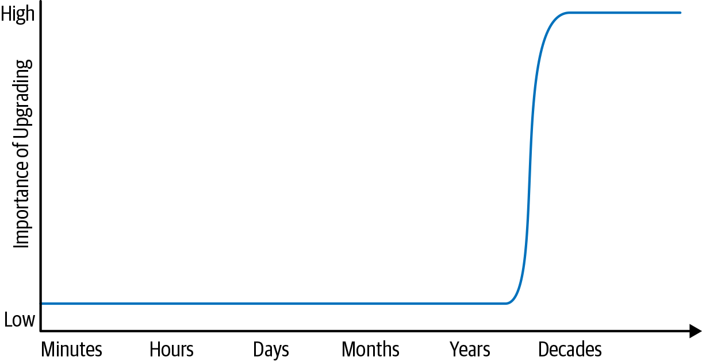

# 时间与变更

当新手学习编程时，生成的代码的生命周期通常以小时或天为单位。 编程作业和练习往往是一次性编写的，几乎不需要重构，当然也不需要长期维护。 这些程序通常不会在初始生产后重新构建或再次执行。 这在教学环境中并不奇怪。 也许在中学或中学后教育中，我们可能会找到团队项目课程或动手论文。 如果是这样，这样的项目可能是唯一一次学生代码寿命超过一个月左右的时间。 这些开发人员可能需要重构一些代码，也许是为了应对不断变化的需求，但他们不太可能被要求应对环境的更广泛变化。

我们还在常见的行业环境中找到了短期代码的开发人员。 移动应用程序的生命周期通常很短，并且无论好坏，完全重写都相对常见。 早期初创公司的工程师可能正确地选择专注于近期目标而不是长期投资：公司可能活得不够长，无法从回报缓慢的基础设施投资中获益。 一个连续启动的开发人员可以非常合理地拥有 10 年的开发经验，并且很少或没有维护任何预计存在时间超过一两年的软件的经验。

另一方面，一些成功的项目实际上具有无限的生命周期：我们无法合理预测 Google 搜索、Linux 内核或 Apache HTTP Server 项目的端点。 对于大多数 Google 项目，我们必须假设它们将无限期存在——我们无法预测何时不需要升级我们的依赖项、语言版本等。 随着他们生命周期的增长，这些长期存在的项目最终会给他们带来与编程任务或初创公司开发不同的感觉。

考虑图 1-1，它展示了这个“预期寿命”范围两端的两个软件项目。 对于从事预期寿命为数小时的任务的程序员来说，什么样的维护是合理的？ 也就是说，如果在您处理将执行一次的 Python 脚本时出现了新版本的操作系统，您是否应该放弃正在做的事情并升级？ 当然不是：升级并不重要。 但在光谱的另一端，谷歌搜索卡在我们 1990 年代的操作系统版本上将是一个明显的问题。



预期寿命范围内的低点和高点表明某处存在过渡。 在一次性计划和持续数十年的项目之间的某个地方，发生了转变：项目必须开始对不断变化的外部性做出反应。对于从一开始就没有计划升级的任何项目，这种转变是 由于三个原因可能会非常痛苦，每个原因都会使其他原因复杂化：

* 您正在执行该项目尚未完成的任务； 更多隐藏的假设已经被嵌入。
* 尝试进行升级的工程师不太可能具有此类任务的经验。
* 升级的规模通常比平时大，一次完成几年的升级而不是更多的增量升级。

因此，在实际经历过一次这样的升级（或中途放弃）之后，高估进行后续升级的成本并决定“再也不会”是非常合理的。 得出这个结论的公司最终承诺只是扔掉东西并重写他们的代码，或者决定不再升级。 与其通过避免痛苦的任务来采取自然的方法，有时更负责任的答案是投资使其不那么痛苦。 这一切都取决于升级的成本、它提供的价值以及相关项目的预期寿命。

不仅要经历第一次重大升级，而且要达到可以可靠地保持最新进展的程度，这是项目长期可持续性的本质。 可持续性需要规划和管理所需变更的影响。 对于谷歌的许多项目，我们相信我们已经实现了这种可持续性，主要是通过反复试验。 那么，具体而言，短期编程与生成预期寿命更长的代码有何不同？ 随着时间的推移，我们需要更加意识到“碰巧工作”和“可维护”之间的区别。 没有完美的解决方案来识别这些问题。 这是不幸的，因为保持软件的长期可维护性是一场持久战。

### 海仑定律

如果你正在维护一个被其他工程师使用的项目，关于“它有效”与“它是可维护的”的最重要的教训是我们称之为海鲁姆定律：

> 有了足够数量的 API 用户，您在合同中承诺什么并不重要：您系统的所有可观察行为都将取决于某人。

根据我们的经验，这个公理是任何关于随时间改变软件的讨论的主导因素。 它在概念上类似于熵：讨论随时间的变化和维护必须注意海鲁姆定律，就像讨论效率或热力学时必须注意熵一样。 仅仅因为熵永远不会减少并不意味着我们不应该试图提高效率。 仅仅因为在维护软件时适用海鲁姆定律并不意味着我们不能为它计划或试图更好地理解它。 我们可以减轻它，但我们知道它永远无法根除。

海鲁姆定律代表了实践知识——即使有最好的意图、最好的工程师和可靠的代码审查实践——我们也不能假设完全遵守已发布的合同或最佳实践。 作为 API 所有者，您将通过明确接口承诺获得一定的灵活性和自由度，但在实践中，给定更改的复杂性和难度还取决于用户发现您的 API 的某些可观察行为的有用程度。 如果用户不能依赖这些东西，你的 API 将很容易改变。 如果有足够的时间和足够多的用户，即使是最无害的更改也会破坏某些内容；您对该更改价值的分析必须包含调查、识别和解决这些破坏的难度。

### 示例：哈希排序

考虑散列迭代排序的例子。 如果我们将五个元素插入到一个基于散列的集合中，我们以什么顺序将它们取出来？

```
>>> for i in {"apple", "banana", "carrot", "durian", "eggplant"}: print(i) 
...
durian
carrot
apple
eggplant
banana
```

大多数程序员都知道哈希表是非明显排序的。 很少有人知道他们使用的特定哈希表是否打算永远提供特定的排序。 这看似不起眼，但在过去的一两年中，计算行业使用此类类型的经验已经发生了变化：

* 散列泛洪攻击为非确定性散列迭代提供了更大的激励。
* 研究改进的散列算法或散列容器的潜在效率增益需要更改散列迭代顺序。
* 根据海鲁姆定律，如果程序员有能力，他们将根据遍历哈希表的顺序编写程序。

因此，如果你问任何专家“我可以为我的哈希容器假设一个特定的输出序列吗？”那位专家大概会说“不”。总的来说，这是正确的，但可能过于简单了。一个更微妙的答案是，“如果你的代码是短暂的，没有改变你的硬件、语言运行时或数据结构的选择，这样的假设是好的。如果你不知道你的代码能存活多久，或者你不能保证你所依赖的任何东西都不会改变，那么这种假设是不正确的。”此外，即使您自己的实现不依赖于散列容器顺序，它也可能被其他隐式创建这种依赖关系的代码使用。例如，如果您的库将值序列化为远程过程调用 (RPC) 响应，则 RPC 调用方可能会根据这些值的顺序结束。&#x20;

这是“它有效”和“它是正确的”之间区别的一个非常基本的例子。对于一个短命的程序，依赖于你的容器的迭代顺序不会造成任何技术问题。另一方面，对于软件工程项目，这种对定义顺序的依赖是一种风险——如果有足够的时间，某些事情会使更改迭代顺序变得有价值。该价值可以通过多种方式体现出来，无论是效率、安全性，还是仅针对未来的数据结构进行验证以允许未来的变化。当该价值变得清晰时，您将需要权衡该价值与破坏开发人员或客户的痛苦之间的权衡。&#x20;

一些语言专门在库版本之间甚至在同一程序的执行之间随机化散列顺序，以试图防止依赖性。但即便如此，仍然有一些海鲁姆定律的惊喜：有些代码使用哈希迭代排序作为效率低下的随机数生成器。现在删除这种随机性会破坏这些用户。正如每个热力学系统的熵都会增加一样，海鲁姆定律也适用于所有可观察到的行为。&#x20;

思考一下以“现在工作”和“无限期工作”心态编写的代码之间的差异，我们可以提取出一些明确的关系。将代码视为具有（高度）可变生命周期要求的工件，我们可以开始对编程风格进行分类：依赖其依赖项的脆弱和未发布特性的代码很可能被描述为“hacky”或“聪明的” ，”而遵循最佳实践并为未来规划的代码更有可能被描述为“干净”和“可维护”。两者都有其目的，但您选择哪一个在很大程度上取决于相关代码的预期寿命。我们常说，“如果‘聪明’是恭维，那是编程，但如果‘聪明’是指责，那是软件工程。”

### 为什么不以“无变化”为目标？

在所有这些关于时间和对变化做出反应的讨论中都隐含着这样一种假设，即变化可能是必要的。是吗？

&#x20;与本书中的其他所有内容一样，这取决于实际情况。我们很乐意承诺“对于大多数项目，在足够长的时间内，它们下面的一切都可能需要更改。”如果您有一个用纯 C 编写的项目，没有外部依赖项（或只有保证长期稳定性的外部依赖项，例如 POSIX），您可能能够避免任何形式的重构或困难的升级。 C 在提供稳定性方面做得很好——在许多方面，这是它的主要目的。

&#x20;大多数项目更多地接触到转移底层技术。大多数编程语言和运行时的变化比 C 多得多。即使是用纯 C 语言实现的库也可能会更改以支持新功能，这会影响下游用户。从处理器到网络库再到应用程序代码，各种技术都公开了安全问题。你的项目所依赖的每一项技术都有一些（希望很小）包含关键错误和安全漏洞的风险，这些风险只有在你开始依赖它之后才会暴露出来。如果您无法为 Heartbleed 部署补丁或缓解诸如 Meltdown 和 Spectre 之类的推测执行问题，因为您已经假设（或承诺）任何事情都不会改变，那么这是一场重大赌博。&#x20;

效率的提高使情况进一步复杂化。我们希望为我们的数据中心配备具有成本效益的计算设备，尤其是提高 CPU 效率。然而，早期谷歌的算法和数据结构在现代设备上效率较低：链表或二叉搜索树仍然可以正常工作，但 CPU 周期与内存延迟之间不断扩大的差距影响了“高效”代码看起来像。随着时间的推移，升级到更新硬件的价值可能会减少，而无需对软件进行相应的设计更改。向后兼容性确保旧系统仍然可以运行，但这并不能保证旧优化仍然有用。不愿意或无法利用此类机会可能会导致巨额成本。像这样的效率问题特别微妙：原始设计可能是完全合乎逻辑的，并且遵循了合理的最佳实践。只有在向后兼容的变化演变之后，一个新的、更有效的选择才变得重要。没有犯错，但时间的流逝仍然使改变变得有价值。&#x20;

刚刚提到的那些担忧是为什么没有投资于可持续性的长期项目存在巨大风险的原因。我们必须能够应对此类问题并利用这些机会，无论它们是直接影响我们还是仅表现为我们所建立的技术的传递性关闭。改变本身并不好。我们不应该为了改变而改变。但我们确实需要有能力改变。如果我们考虑到最终的必要性，我们还应该考虑是否投资使该能力变得便宜。正如每个系统管理员都知道的那样，从理论上知道您可以从磁带中恢复是一回事，而在实践中确切地知道如何进行恢复以及在必要时需要花费多少成本又是另一回事。实践和专业知识是效率和可靠性的重要驱动因素。
